<!-- README.md is generated from README.Rmd. Please edit that file -->

# gguke

<!-- badges: start -->

<!-- badges: end -->

The goal of gguke is to …

What is special about using `README.Rmd` instead of just `README.md`?
You can include R chunks like so:

``` r


CM <- 
"pppp
----
----
---3"


library(tidyverse)
#> ── Attaching core tidyverse packages ─────────────────── tidyverse 2.0.0.9000 ──
#> ✔ dplyr     1.1.0          ✔ readr     2.1.4     
#> ✔ forcats   1.0.0          ✔ stringr   1.5.0     
#> ✔ ggplot2   3.4.4.9000     ✔ tibble    3.2.1     
#> ✔ lubridate 1.9.2          ✔ tidyr     1.3.0     
#> ✔ purrr     1.0.1          
#> ── Conflicts ────────────────────────────────────────── tidyverse_conflicts() ──
#> ✖ dplyr::filter() masks stats::filter()
#> ✖ dplyr::lag()    masks stats::lag()
#> ℹ Use the conflicted package (<http://conflicted.r-lib.org/>) to force all conflicts to become errors

parse_chord <- function(chord = CM){

play_TF <- chord |> stringr::str_split("") %>%  .[[1]] %>% .[1:4]
chart <- chord |> stringr::str_split("") %>%  .[[1]] %>% .[5:length(.)] 

num_frets <- length(chart)/5

string <- rep(1:4, num_frets)
fret <- sort(rep(1:num_frets, 4))

data.frame(finger = chart) %>% 
  filter(finger != "\n") %>% 
  mutate(fret = fret) %>% 
  mutate(string = string) %>% 
  mutate(finger = ifelse(finger == "-", NA, finger) %>% as.numeric()) %>% 
  filter(!is.na(finger)) ->
fingering_df

list(play_tf = play_TF, 
     fingering_df = fingering_df)

}


library(ggstamp)
ggstamp::ggcanvas() + 
  stamp_segment(x = 1:4, y = .5, xend = 1:4, yend = 5) + 
  stamp_segment(y = 0:4 +.5, yend = 0:4 +.5, x = 1, xend = 4) + 
  scale_y_reverse() + 
  theme_void() + 
  scale_fill_viridis_c(limits = c(1,4), guide = F) +
  NULL ->
background 


FM <- 
"pppp
--1-
2---
----"

background + 
  geom_point(data = parse_chord()[[2]],
             size = 15, 
             aes(x = string, y = fret),
             color = "white"
             ) +
  geom_point(data = parse_chord()[[2]],
             size = 15, pch = 21, alpha = .6,
             aes(x = string, y = fret,
                 fill = finger), 
             ) +
  geom_text(data = parse_chord()[[2]],
             size = 10,
             aes(x = string, y = fret, label = finger)
             ) + 
  labs(caption = "Come stop your cryin', it'll be all right" %>% str_wrap(20)) + 
  theme(text = element_text(size = 18))
#> Warning: The `guide` argument in `scale_*()` cannot be `FALSE`. This was deprecated in
#> ggplot2 3.3.4.
#> ℹ Please use "none" instead.
#> ℹ The deprecated feature was likely used in the ggstamp package.
#>   Please report the issue to the authors.
#> This warning is displayed once every 8 hours.
#> Call `lifecycle::last_lifecycle_warnings()` to see where this warning was
#> generated.
```

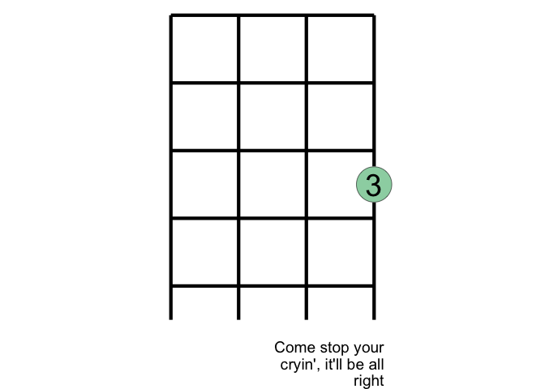<!-- -->

``` r
add_chord_fingering <- function(chord = CM){
  
   list(  geom_point(data = parse_chord(chord)[[2]],
             size = 15,
             aes(x = string, y = fret),
             color = "white"
             ) ,
  geom_point(data = parse_chord(chord)[[2]],
             size = 15, pch = 21, alpha = .6,
             aes(x = string, y = fret,
                 fill = finger),
             ) ,
  geom_text(data = parse_chord(chord)[[2]],
             size = 10,
             aes(x = string, y = fret, label = finger)
             )
   )
}
  
add_lyric <- function(lyric = "Come stop your cryin', it'll be all right"){
  
    list(labs(caption = lyric %>% str_wrap(28)),
    theme(text = element_text(size = 23)))
  
  
}

background + 
  add_chord_fingering(CM) + 
  add_lyric("Just take my hand and hold it tight")
```

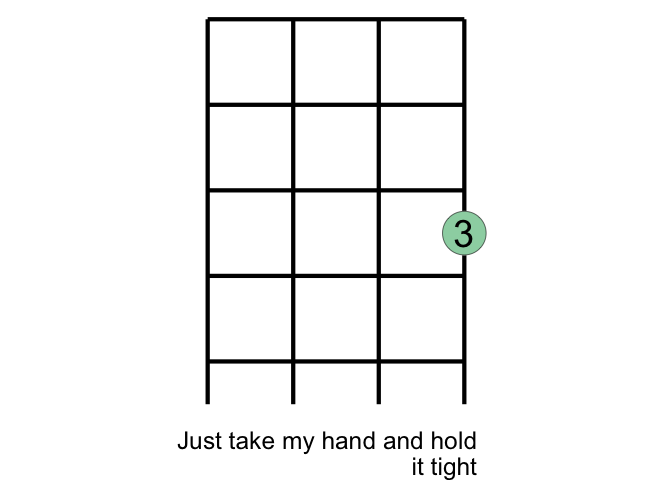<!-- -->

``` r
  


background + 
  add_chord_fingering(FM) + 
  add_lyric("I will protect you from all around you")
```

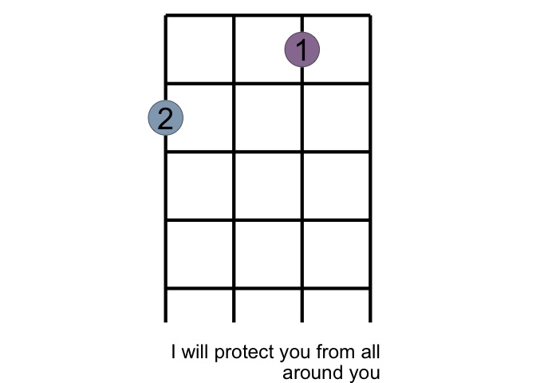<!-- -->

``` r

Dm <- 
"pppp
--1-
23--
----"


background + 
  add_chord_fingering(Dm) + 
  add_lyric("I will be here don't you ...")
```

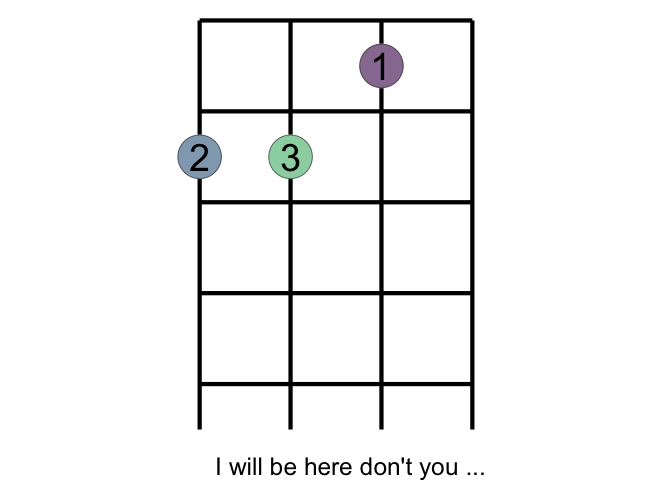<!-- -->

``` r


GM <- 
"pppp
----
-1-2
--3-"


background + 
  add_chord_fingering(GM) + 
  add_lyric(" ... cry")
```

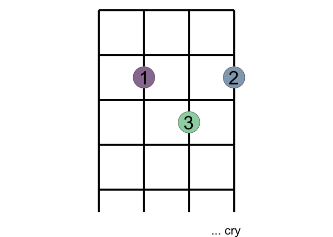<!-- -->

``` r


background + 
  add_chord_fingering(CM) + 
  add_lyric("For one so small, you seem so strong")
```

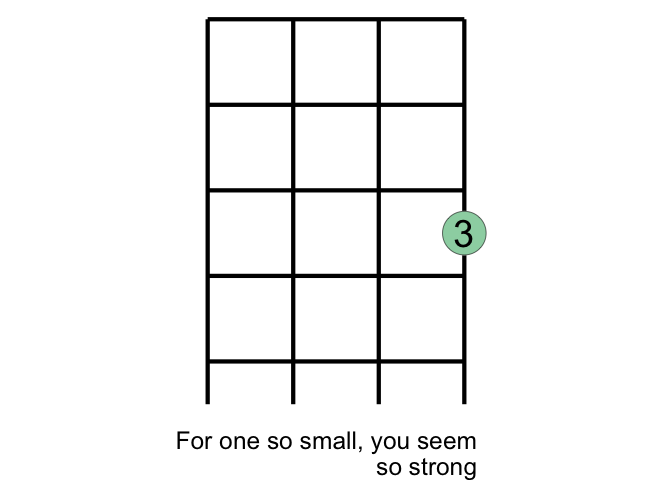<!-- -->

``` r

background + 
  add_chord_fingering(CM) + 
  add_lyric("My arms will hold you keep you safe and warm")
```

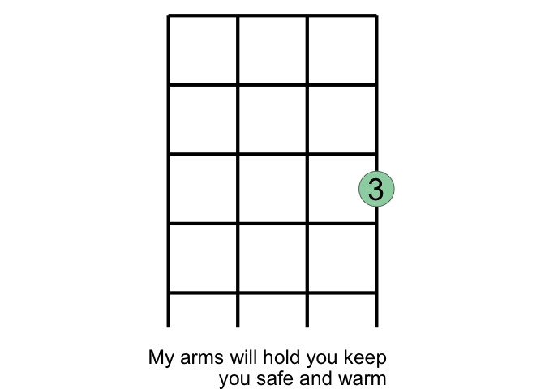<!-- -->

``` r


background + 
  add_chord_fingering(FM) + 
  add_lyric("This bond between us can't be broken")
```

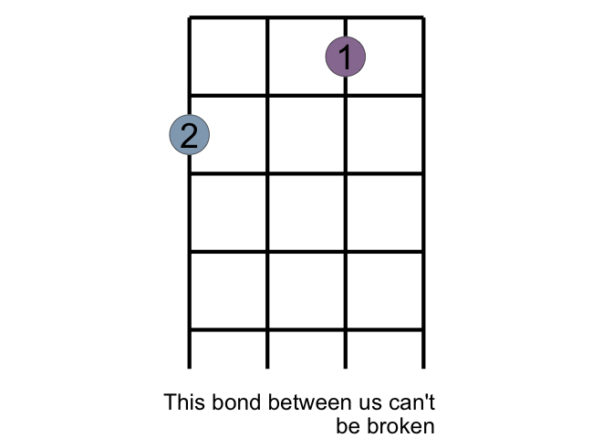<!-- -->

``` r


background + 
  add_chord_fingering(Dm) + 
  add_lyric("I will be here don't you ...")
```

<!-- -->

``` r

background + 
  add_chord_fingering(GM) + 
  add_lyric("... cry")
```

<!-- -->

``` r

E7M <- 
"pppp
1---
-2-3
----"

background + 
  add_chord_fingering(E7M) + 
  add_lyric("... ")
```

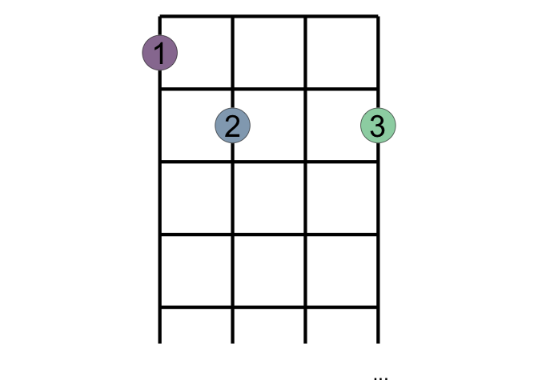<!-- -->

``` r


AM <- 
"pppp
-1--
2---
----"

background + 
  add_chord_fingering(AM) + 
  add_lyric("You'll be in my ...")
```

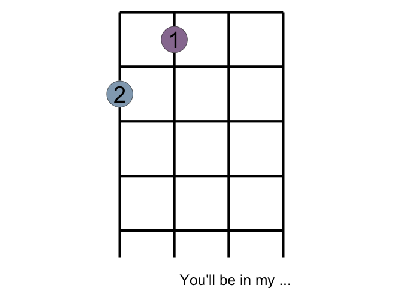<!-- -->

``` r


DM <- 
"pppp
----
123-
----"

background + 
  add_chord_fingering(DM) + 
  add_lyric("... heart")
```

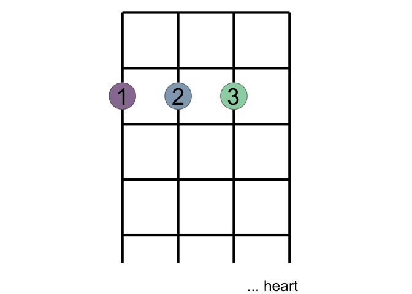<!-- -->

``` r

background + 
  add_chord_fingering(E7M) + 
  add_lyric("You'll be in my ...")
```

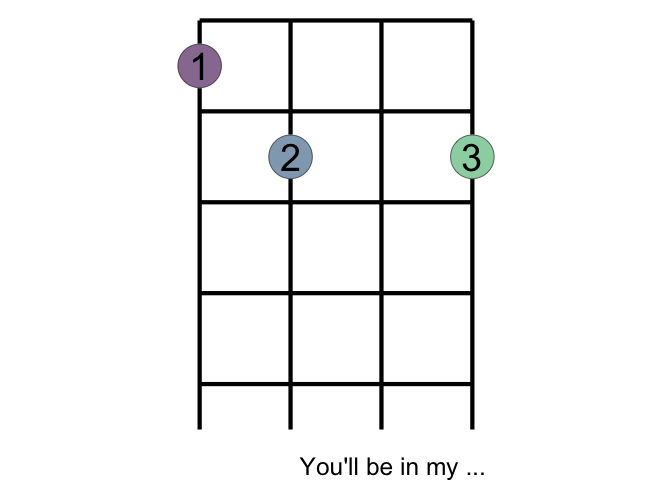<!-- -->

``` r


Dbm <- 
"pppp
12--
----
----"


background + 
  add_chord_fingering(Dbm) + 
  add_lyric(" ... heart")
```

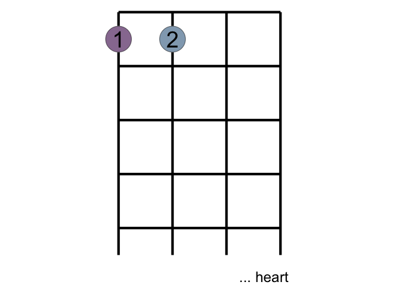<!-- -->

``` r

background + 
  add_chord_fingering(AM)  + 
  add_lyric("From this day on ")
```

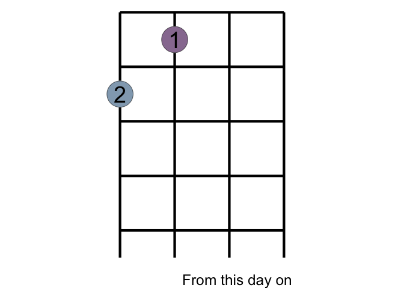<!-- -->

``` r


background + 
  add_chord_fingering(DM)  + 
  add_lyric("Now and forever")
```

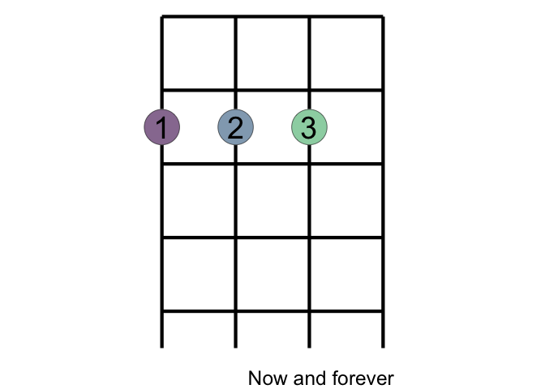<!-- -->

``` r


background + 
  add_chord_fingering(GM)  + 
  add_lyric(" ... more")
```

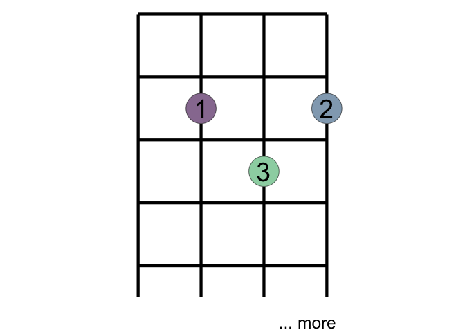<!-- -->

``` r

background + 
  add_chord_fingering(E7M)  + 
  add_lyric(" ...")
```

<!-- -->

``` r

###################


Fsm <- 
"pppp
-1--
2-3-
----"


background + 
  add_chord_fingering(Fsm)
```

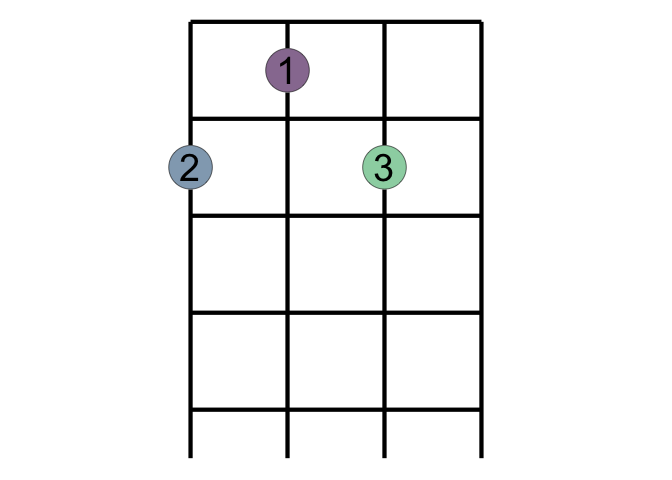<!-- -->

``` r

background + 
  add_chord_fingering(GM)
```

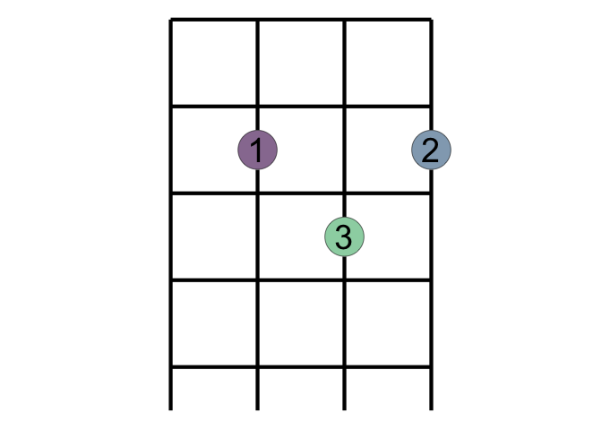<!-- -->

``` r
lyric_chord_df <- tribble(~lyric, ~chord_name,
        "Come stop your cryin', it'll be all right", "CM",
"Come stop your crying
It will be alright
Just take my hand
Hold it tight
I will protect you
From all around you
I will be here
Don't you cry
For one so small
You seem so strong
My arms will hold you
Keep you safe and warm
This bond between us
Can't be broken
I will be here don't you cry
'Cause you'll be in my heart
Yes, you'll be in my heart
From this day on
Now and forever more
You'll be in my heart
No matter what they say
You'll be here in my heart
Always  "      
        )
```

You’ll still need to render `README.Rmd` regularly, to keep `README.md`
up-to-date. `devtools::build_readme()` is handy for this. You could also
use GitHub Actions to re-render `README.Rmd` every time you push. An
example workflow can be found here:
<https://github.com/r-lib/actions/tree/v1/examples>.

You can also embed plots, for example:

<!-- -->

In that case, don’t forget to commit and push the resulting figure
files, so they display on GitHub.
