  - [gguke is under construction\! 🚧 Feedback
    welcome\!](#gguke-is-under-construction--feedback-welcome)
      - [**Chord info input**](#chord-info-input)
          - [Translate to data frame. Can be used in
            ggplot2](#translate-to-data-frame-can-be-used-in-ggplot2)
          - [Make it a function…](#make-it-a-function)
      - [then we need a **fret board**.](#then-we-need-a-fret-board)
          - [make it once](#make-it-once)
          - [looks good; make it a
            function](#looks-good-make-it-a-function)
      - [now we’ll place **fingers positions** w/ point and
        text](#now-well-place-fingers-positions-w-point-and-text)
          - [looks great\! Make a
            function](#looks-great-make-a-function)
      - [Okay, **add lyrics**](#okay-add-lyrics)
          - [looks good… make it a
            function\!](#looks-good-make-it-a-function-1)
          - [Test it out](#test-it-out)
          - [test again with new chord
            input](#test-again-with-new-chord-input)
      - [Build up small **chord
        library**](#build-up-small-chord-library)
          - [Lets include the chords as data in the package. We can add
            some more later. Also, you can overwrite what’s here, if
            there is a better
            fingering.](#lets-include-the-chords-as-data-in-the-package-we-can-add-some-more-later-also-you-can-overwrite-whats-here-if-there-is-a-better-fingering)
      - [from **lyric-chord data frame to
        chart**…](#from-lyric-chord-data-frame-to-chart)
          - [use a lyrics-chord data
            frame.](#use-a-lyrics-chord-data-frame)
          - [Looks good\!\!\! excited to put in a
            function\!](#looks-good-excited-to-put-in-a-function)
      - [Holiday song\! “Let it snow”](#holiday-song-let-it-snow)
      - [gershwin](#gershwin)
  - [Part II. Packaging and documentation 🚧
    ✅](#part-ii-packaging-and-documentation--)
      - [Phase 1. Minimal working
        package](#phase-1-minimal-working-package)
          - [Created files for **package archetecture** with
            `devtools::create(".")`
            ✅](#created-files-for-package-archetecture-with-devtoolscreate-)
          - [Moved **functions R folder**?
            ✅](#moved-functions-r-folder-)
          - [Added **roxygen skeleton**? 🚧](#added-roxygen-skeleton-)
          - [Managed **dependencies** ? ✅](#managed-dependencies--)
          - [Chosen a package **license**?
            🚧](#chosen-a-package-license-)
          - [Run `devtools::check()` and addressed errors?
            🚧](#run-devtoolscheck-and-addressed-errors-)
          - [Build package 🚧](#build-package-)
          - [Make aspirational part of readme real.
            🚧](#make-aspirational-part-of-readme-real-)
          - [Add lifecycle badge
            (experimental)](#add-lifecycle-badge-experimental)
      - [Phase 2: Listen & iterate 🚧](#phase-2-listen--iterate-)
      - [Phase 3: Let things settle](#phase-3-let-things-settle)
          - [Settle on examples. Put them in the roxygen skeleton and
            readme.
            🚧](#settle-on-examples-put-them-in-the-roxygen-skeleton-and-readme-)
          - [Written formal tests of functions?
            🚧](#written-formal-tests-of-functions-)
          - [Have you worked added a description and author information
            in the DESCRIPTION file?
            🚧](#have-you-worked-added-a-description-and-author-information-in-the-description-file-)
          - [Addressed *all* notes, warnings and errors.
            🚧](#addressed-all-notes-warnings-and-errors-)
      - [Promote to wider audience…](#promote-to-wider-audience)
          - [Package website built? 🚧](#package-website-built-)
          - [Package website deployed? 🚧](#package-website-deployed-)
      - [Phase 3: Harden/commit](#phase-3-hardencommit)
          - [Submit to CRAN? Or don’t. 🚧](#submit-to-cran-or-dont-)
  - [Appendix: Reports, Environment](#appendix-reports-environment)
      - [Description file extract](#description-file-extract)
      - [Environment](#environment)
      - [`devtools::check()` report](#devtoolscheck-report)
  - [test functions from package, use :: (or
    :::)](#test-functions-from-package-use--or-)

<!-- README.md is generated from README.Rmd. Please edit that file -->

# gguke is under construction\! 🚧 Feedback welcome\!

<!-- badges: start -->

[](https://lifecycle.r-lib.org/articles/stages.html#experimental)
<!-- badges: end -->

{gguke} will provide tools for visualizing ukelele chords with lyrics.
This is for people that aren’t so good at ukelele; they may not really
know the chords yet. It’s a chord-first approach to song charts, which
might have only chord names or small finger position.

And because we make it with ggplot2, we can do a lot with customization.
For example, fingers get assigned a color using the viridis palette.

This is currently a [{readme2pkg}]() project; we’re writing in a kind-of
stream of consciousness way, bundling up useful code into functions as
we go in our README.rmd narrative, and then sending written-up functions
to our R folder with knitr/rmd magic. Our commitment to keeping things
as they are is low at this point, but it is a real package. Lifecycle is
*early* experimental. See also [{litr}]().

Beyond the descriptions of our work, we interject comments on our
hesitations 🤔 and areas that need some work 🚧, for your consideration
marked with emoji.

## **Chord info input**

First, something I’m very excited about, a new-chord ingestion proposal…
- it’s just text. Here’s a C major fingering, where first line is
whether string is played or not. There are four strings across, the
number indicates where on the fret board the specific finger should be
placed:

``` r
CM <- 
"pppp
----
----
---3"
```

### Translate to data frame. Can be used in ggplot2

Then translate that to data frame that records string, fret, and finger
that will play each note. I’m just doing the first thing that came to
mind - some string manipulation, but might move to read.delim…

``` r

CM |> stringr::str_split("") %>%  .[[1]] %>% .[1:4]
#> [1] "p" "p" "p" "p"

chart <- CM |> stringr::str_split("") %>%  .[[1]] %>% .[5:length(.)] 
num_frets <- length(chart)/5
string <- rep(1:4, num_frets)
fret <- sort(rep(1:num_frets, 4))

data.frame(finger = chart) %>% 
  dplyr::filter(finger != "\n") %>% 
  dplyr::mutate(fret = fret) %>% 
  dplyr::mutate(string = string) %>% 
  dplyr::mutate(finger = ifelse(.data$finger == "-", NA, finger) %>% as.numeric()) %>% 
  dplyr::filter(!is.na(finger)) 
#>   finger fret string
#> 1      3    3      4
```

### Make it a function…

``` r
parse_chord <- function(chord = CM){

play_TF <- chord |> stringr::str_split("") %>%  .[[1]] %>% .[1:4]

chart <- chord |> stringr::str_split("") %>%  .[[1]] %>% .[5:length(.)] 
num_frets <- length(chart)/5
string <- rep(1:4, num_frets)
fret <- sort(rep(1:num_frets, 4))

data.frame(finger = chart) %>% 
  dplyr::filter(finger != "\n") %>% 
  dplyr::mutate(fret = fret) %>% 
  dplyr::mutate(string = string) %>% 
  dplyr::mutate(finger = ifelse(.data$finger == "-", NA, finger) %>% as.numeric()) %>% 
  dplyr::filter(!is.na(finger)) ->
fingering_df

list(play_tf = play_TF, 
     fingering_df = fingering_df)

}
```

``` r

# play or not for each string
parse_chord()[[1]]
#> [1] "p" "p" "p" "p"

# dataframe with finger placement info
parse_chord()[[2]]
#>   finger fret string
#> 1      3    3      4
```

🤔 maybe read.delim(delim = ""), would work better and feel more grokable
that this string split business\! :-)

``` r
usethis::use_pipe()
#> ✔ Setting active project to '/Users/evangelinereynolds/Google
#> Drive/r_packages/gguke'
readme2pkg::chunk_to_r("parse_chord")
```

## then we need a **fret board**.

### make it once

``` r
library(ggplot2)
ggplot() + 
  annotate(geom = "segment", x = 1:4, y = .5, 
           xend = 1:4, yend = 5, linewidth = 3) + 
  annotate(geom = "segment", y = 0:4 +.5, 
           yend = 0:4 +.5, x = 1, xend = 4, linewidth = 3) + 
  scale_y_reverse() + 
  scale_x_continuous(expand = expansion(.2)) +
  theme_void() + 
  coord_equal() +
  scale_fill_viridis_c(limits = c(1,4), guide = F)
#> Warning: The `guide` argument in `scale_*()` cannot be `FALSE`. This was deprecated in
#> ggplot2 3.3.4.
#> ℹ Please use "none" instead.
#> This warning is displayed once every 8 hours.
#> Call `lifecycle::last_lifecycle_warnings()` to see where this warning was
#> generated.
```

<!-- -->

### looks good; make it a function

``` r
uke_fretboard <- function(){
  
  ggplot() + 
  annotate(geom = "segment", x = 1:4, y = .5, 
           xend = 1:4, yend = 5, linewidth = 3) + 
  annotate(geom = "segment", y = 0:4 +.5, 
           yend = 0:4 +.5, x = 1, xend = 4, linewidth = 3) + 
  scale_y_reverse() + 
  scale_x_continuous(expand = expansion(.2)) +
  theme_void() + 
  coord_equal() +
  scale_fill_viridis_c(limits = c(1,4), guide = F) 
  
}
```

🤔 maybe gguke() would be better 🤔 maybe a coord\_uke could be a
long-term goal.

``` r
readme2pkg::chunk_to_r("uke_fretboard")
```

## now we’ll place **fingers positions** w/ point and text

``` r
uke_fretboard() + 
  geom_point(data = parse_chord()[[2]],
             size = 15, 
             aes(x = string, y = fret),
             color = "white"
             ) +
  geom_point(data = parse_chord()[[2]],
             size = 15, pch = 21, alpha = .6,
             aes(x = string, y = fret,
                 fill = finger), 
             ) +
  geom_text(data = parse_chord()[[2]],
             size = 10,
             aes(x = string, y = fret, label = finger)
             )
```

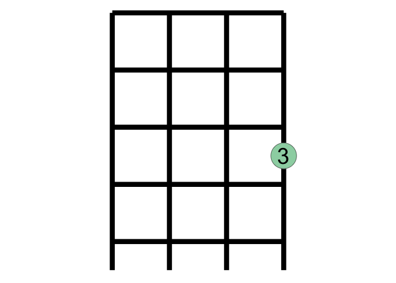<!-- -->

### looks great\! Make a function

``` r
add_chord_fingering <- function(chord = CM){
  
   list(  geom_point(data = parse_chord(chord)[[2]],
             size = 15,
             aes(x = string, y = fret),
             color = "white"
             ) ,
  geom_point(data = parse_chord(chord)[[2]],
             size = 15, pch = 21, alpha = .6,
             aes(x = string, y = fret,
                 fill = finger),
             ) ,
  geom_text(data = parse_chord(chord)[[2]],
             size = 10,
             aes(x = string, y = fret, label = finger)
             )
   )
}
```

``` r
readme2pkg::chunk_to_r("add_chord_fingering")
```

## Okay, **add lyrics**

``` r
uke_fretboard() +
  add_chord_fingering() +
  labs(caption = "Come stop your cryin', it'll be all right" %>% str_wrap(28)) + 
  theme(text = element_text(size = 23))
```

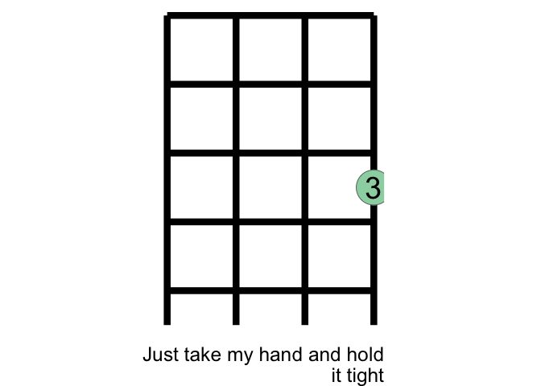<!-- -->

### looks good… make it a function\!

``` r

add_lyric <- function(lyric = "Come stop your cryin', it'll be all right"){
  
    list(labs(caption = lyric %>% str_wrap(28)),
         theme(text = element_text(size = 23)))
  
  
}
```

``` r
readme2pkg::chunk_to_r("add_lyric")
```

### Test it out

``` r
uke_fretboard() + 
  add_chord_fingering(CM) + 
  add_lyric("Just take my hand and hold it tight")
```

<!-- -->

### test again with new chord input

``` r

FM <- 
"pppp
--1-
2---
----"

uke_fretboard() + 
  add_chord_fingering(FM) + 
  add_lyric("I will protect you from all around you")
```

<!-- -->

## Build up small **chord library**

``` r
Dm <- 
"pppp
--1-
23--
----"

GM <- 
"pppp
----
-1-2
--3-"

E7M <- 
"pppp
1---
-2-3
----"

AM <- 
"pppp
-1--
2---
----"

DM <- 
"pppp
----
123-
----"

Dbm <- 
"pppp
12--
----
----"

Fsm <- 
"pppp
-1--
2-3-
----"


D7M <- 
"pppp
----
1111
---2"


A7M <- 
"pppp
-1--
----
----"


Am <- 
"pppp
1---
----
----"


Am7 <- 
"pppp
----
----
----"

Bm <- 
"pppp
----
-111
----
3---"


Em <- 
"pppp
----
---1
----
-3--"

G <- GM
D <- DM
E7 <- E7M
A7 <- A7M
D7 <- D7M
```

### Lets include the chords as data in the package. We can add some more later. Also, you can overwrite what’s here, if there is a better fingering.

Would like to use \# but using s for sharp since \# is a special
character… Feels a little weird.

``` r
usethis::use_data(CM, overwrite = T)
#> ✔ Saving 'CM' to 'data/CM.rda'
#> • Document your data (see 'https://r-pkgs.org/data.html')
usethis::use_data(FM, overwrite = T)
#> ✔ Saving 'FM' to 'data/FM.rda'
#> • Document your data (see 'https://r-pkgs.org/data.html')
usethis::use_data(Dm, overwrite = T)
#> ✔ Saving 'Dm' to 'data/Dm.rda'
#> • Document your data (see 'https://r-pkgs.org/data.html')
usethis::use_data(GM, overwrite = T)
#> ✔ Saving 'GM' to 'data/GM.rda'
#> • Document your data (see 'https://r-pkgs.org/data.html')
usethis::use_data(E7M, overwrite = T)
#> ✔ Saving 'E7M' to 'data/E7M.rda'
#> • Document your data (see 'https://r-pkgs.org/data.html')
usethis::use_data(AM, overwrite = T)
#> ✔ Saving 'AM' to 'data/AM.rda'
#> • Document your data (see 'https://r-pkgs.org/data.html')
usethis::use_data(DM, overwrite = T)
#> ✔ Saving 'DM' to 'data/DM.rda'
#> • Document your data (see 'https://r-pkgs.org/data.html')
usethis::use_data(Dbm, overwrite = T)
#> ✔ Saving 'Dbm' to 'data/Dbm.rda'
#> • Document your data (see 'https://r-pkgs.org/data.html')
usethis::use_data(Fsm, overwrite = T)
#> ✔ Saving 'Fsm' to 'data/Fsm.rda'
#> • Document your data (see 'https://r-pkgs.org/data.html')
```

``` r
"CM"
#> [1] "CM"
"FM"
#> [1] "FM"
"Dm"
#> [1] "Dm"
"GM"
#> [1] "GM"
"E7M"
#> [1] "E7M"
"AM"
#> [1] "AM"
"DM"
#> [1] "DM"
"Dbm"
#> [1] "Dbm"
"Fsm"
#> [1] "Fsm"
```

## from **lyric-chord data frame to chart**…

### use a lyrics-chord data frame.

``` r
library(tidyverse)
library(gguke)
lyric_chord_df <- tibble::tribble(~lyric, ~chord_name,
        "Come stop your cryin', it'll be all right", "CM",
"Just take my hand, hold it tight", "CM",
"I will protect you, from all around you", "FM",
"I will be here, don't you ","Dm",
"...cry" , "GM" ,
" ", "E7M",
"'Cause you'll be in my ... heart", "AM",
"... heart", "DM",
"Yes, you'll be in my heart", "E7M",
"... heart", "Dbm", 
"From this day on", "AM",
"Now and forever... more", "DM",
"... more", "GM",
"...", "E7M",
"You'll be in my ...", "AM",
"... heart", "DM",
"No matter what they ...", "E7M",
"say", "Dbm", 
"You'll be here in my... ", "AM", 
" heart", "DM",
"Always", "GM")

lyric_chord_df %>% pull(chord_name) %>% unique()
#> [1] "CM"  "FM"  "Dm"  "GM"  "E7M" "AM"  "DM"  "Dbm"


parse_chord2 <- function(chord){parse_chord(chord)[[2]]}

Dm
#> [1] "pppp\n--1-\n23--\n----"
lyric_chord_df[1:6,] %>% #just vis first six lyric-chord pairs
  mutate(phrase = row_number()) %>% 
  mutate(fingering_str = map(chord_name, get)) ->
lyric_chord_df_flat


lyric_chord_df_flat %>% 
  unnest(cols = c(fingering_str)) %>% 
  mutate(fingering = map(fingering_str, parse_chord2)) %>% 
  unnest(cols = c(fingering)) ->
lyric_chord_df_fingering
  
lyric_chord_df_fingering %>% 
  ggplot() +
  annotate(geom = "segment", x = 1:4, y = .5, 
           xend = 1:4, yend = 5, linewidth = 1) + 
  annotate(geom = "segment", y = 0:4 +.5, 
           yend = 0:4 +.5, x = 1, xend = 4, linewidth = 1) +
  aes(x = string, y = fret, label = finger) + 
  geom_point(size = 6, color = "white") +
  geom_point(size = 6, pch= 21, aes(fill = finger), alpha = .7 , show.legend = F) +
  geom_text() +
  facet_wrap(~ paste0("phrase ", phrase,": ", chord_name) %>% fct_inorder()) + 
  geom_text(data = lyric_chord_df_flat,
            x = 1, y = -5.5, size = 3,
            aes(label = lyric %>% str_wrap(28)),
            hjust = 0,
            vjust = 1) + 
  scale_y_reverse(limits = c(7, .5)) + 
  coord_equal() + 
  scale_fill_viridis_c(end = .9) + 
  scale_x_continuous(expand = expansion(.6)) + 
  theme_void()
```

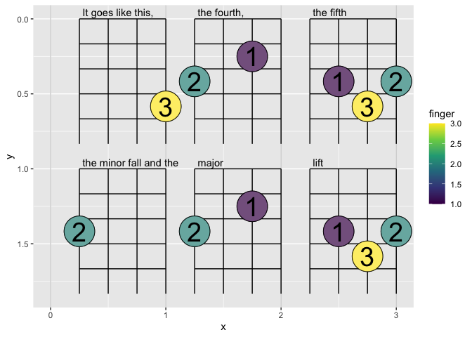<!-- -->

``` r

ggwipe::last_plot_wipe(index = 4) + 
    geom_point(size = 6, pch= 21, fill = alpha("white", 0), show.legend = F) 
```

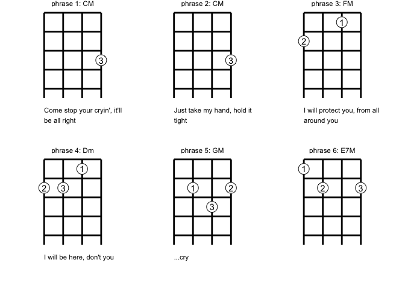<!-- -->

### Looks good\!\!\! excited to put in a function\!

``` r

parse_chord2 <- function(chord){parse_chord(chord)[[2]]}


lyric_chord_df_to_chart <- function(lyric_chord_df, bw = F){
  
  lyric_chord_df %>% 
  mutate(phrase = row_number()) %>% 
  mutate(fingering_str = map(chord_name, get)) ->
lyric_chord_df_flat

lyric_chord_df_flat %>% 
  unnest(cols = c(fingering_str)) %>% 
  mutate(fingering = map(fingering_str, parse_chord2)) %>% 
  unnest(cols = c(fingering)) ->
lyric_chord_df_fingering
  
lyric_chord_df_fingering %>% 
  ggplot() +
  annotate(geom = "segment", x = 1:4, y = .5, 
           xend = 1:4, yend = 5, linewidth = 1) + 
  annotate(geom = "segment", y = 0:4 +.5, 
           yend = 0:4 +.5, x = 1, xend = 4, linewidth = 1) +
  aes(x = string, y = fret, label = finger) + 
  geom_point(size = 6, color = "white") +
  geom_point(size = 6, pch= 21, aes(fill = finger), alpha = .7 , show.legend = F) +
  geom_text() +
  facet_wrap(~ paste0("phrase ", phrase,": ", chord_name) %>% fct_inorder()) +
  geom_text(data = lyric_chord_df_flat,
            x = 1, y = -5.5, size = 3,
            aes(label = lyric %>% str_wrap(28)),
            hjust = 0,
            vjust = 1) + 
  scale_y_reverse(limits = c(7, .5)) + 
  coord_equal() + 
  scale_fill_viridis_c(end = .9) + 
  scale_x_continuous(expand = expansion(.6)) + 
  theme_void() ->
plot


if(bw){
  plot$layers[[4]] <- NULL
 plot + 
    geom_point(size = 6, pch= 21, fill = alpha("white", 0), show.legend = F)->
   plot
}
  
plot

}
```

``` r
readme2pkg::chunk_to_r("lyric_chord_df_to_chart")
```

``` r
lyric_chord_df_to_chart(lyric_chord_df[1:6,])
```

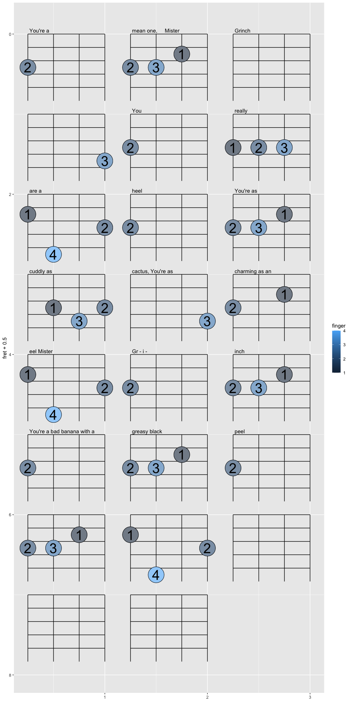<!-- -->

``` r
lyric_chord_df_to_chart(lyric_chord_df[7:12,])
```

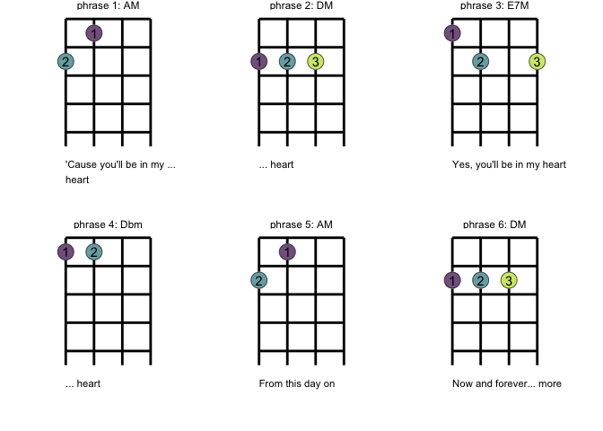<!-- -->

``` r
lyric_chord_df_to_chart(lyric_chord_df[13:18,])
```

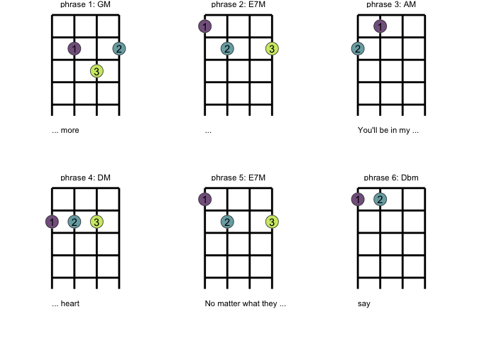<!-- -->

``` r
lyric_chord_df_to_chart(lyric_chord_df[19:21,])
```

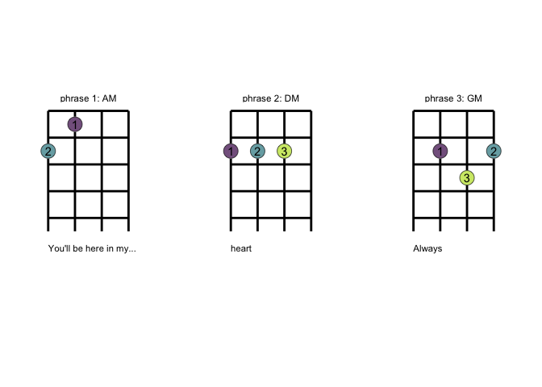<!-- -->

``` r

a_cool_song <- tibble::tribble(~lyric, ~chord_name,
                       "This is my cool lyric", "CM",
                       "This is another", "DM",
                       "hi", "GM",
                       "hola hola!", "E7M")

lyric_chord_df_to_chart(lyric_chord_df = a_cool_song, bw = T) 
```

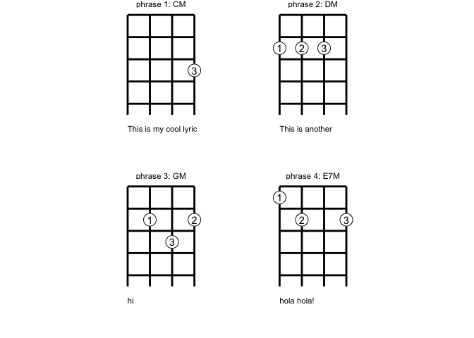<!-- -->

## Holiday song\! “Let it snow”

``` r
song <- readLines("Untitled.txt")
#> Warning in readLines("Untitled.txt"): incomplete final line found on
#> 'Untitled.txt'
song_line <- sort(rep(1:(length(song)/2),2))
characters <- song %>% stringr::str_split("") 
element <- rep(c("chord", "lyric"), length(song)/2)


rep_spaces <- function(x){
  
  rep("", x)
}

combine <- function(x, y){
  
  
  c(x, y)
  
}

tibble(song_line, characters, element)  %>% 
  mutate(num_char = map_dbl(characters, length)) %>% 
  group_by(song_line) %>% 
  mutate(max_char = max(num_char)) %>% 
  ungroup() %>% 
  mutate(diff_char = max_char - num_char) %>% 
  mutate(spaces_to_add = map(diff_char, rep_spaces)) %>% 
  mutate(chars_evened_up = map2(characters, spaces_to_add, combine) ) %>% 
  pivot_wider(id_cols = song_line, 
              names_from = element, 
              values_from = chars_evened_up) %>% 
  unnest() %>% 
  mutate(ind_chord_space = chord == " ") %>% 
  mutate(ind_init_chord = !ind_chord_space & lag(ind_chord_space)) %>% 
  mutate(ind_init_chord = replace_na(ind_init_chord, FALSE) ) %>% 
  mutate(id_chord_phrase = cumsum(ind_init_chord)) %>% 
  group_by(id_chord_phrase) %>% 
  summarize(lyric = paste(lyric, collapse = ""),
            chord_name = paste(chord, collapse = "") %>% str_trim()) ->
snow_from_txt
#> Warning: `cols` is now required when using `unnest()`.
#> ℹ Please use `cols = c(chord, lyric)`.
```

``` r
lyric_chord_df_to_chart(snow_from_txt[2:7,], bw = T)
```

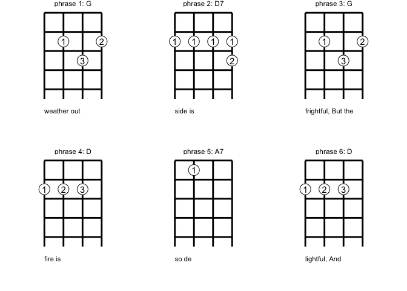<!-- -->

``` r
lyric_chord_df_to_chart(snow_from_txt[8:13,], bw = T)
```

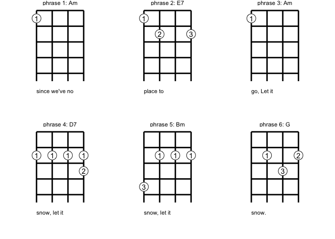<!-- -->

``` r

txt_chord_lyrics_to_df <- function(path){

song <- readLines(path)
song_line <- sort(rep(1:(length(song)/2),2))
characters <- song %>% stringr::str_split("") 
element <- rep(c("chord", "lyric"), length(song)/2)


rep_spaces <- function(x){
  
  rep("", x)
}

combine <- function(x, y){
  
  
  c(x, y)
  
}
tibble(song_line, characters, element)  %>% 
  mutate(num_char = map_dbl(characters, length)) %>% 
  group_by(song_line) %>% 
  mutate(max_char = max(num_char)) %>% 
  ungroup() %>% 
  mutate(diff_char = max_char - num_char) %>% 
  mutate(spaces_to_add = map(diff_char, rep_spaces)) %>% 
  mutate(chars_evened_up = map2(characters, spaces_to_add, combine) ) %>% 
  pivot_wider(id_cols = song_line, 
              names_from = element, 
              values_from = chars_evened_up) %>% 
  unnest() %>% 
  mutate(ind_chord_space = chord == " ") %>% 
  mutate(ind_init_chord = !ind_chord_space & lag(ind_chord_space)) %>% 
  mutate(ind_init_chord = replace_na(ind_init_chord, FALSE) ) %>% 
  mutate(id_chord_phrase = cumsum(ind_init_chord)) %>% 
  group_by(id_chord_phrase) %>% 
  summarize(lyric = paste(lyric, collapse = ""),
            chord_name = paste(chord, collapse = "") %>% str_trim())

}
```

## gershwin

  - “F” chord reared it’s ugly head, I find/replaced with FM but maybe
    this can be better managed
  - There may have been a problem with phrases that don’t start with a
    new chord. I worked on it in the text file.

<!-- end list -->

``` r
gershwin_ly_ch_df <- txt_chord_lyrics_to_df("gershwin.txt")
#> Warning in readLines(path): incomplete final line found on 'gershwin.txt'
#> Warning: `cols` is now required when using `unnest()`.
#> ℹ Please use `cols = c(chord, lyric)`.
dim(gershwin_ly_ch_df)
#> [1] 38  3
lyric_chord_df_to_chart(gershwin_ly_ch_df[1:6,]  , bw = T)
```

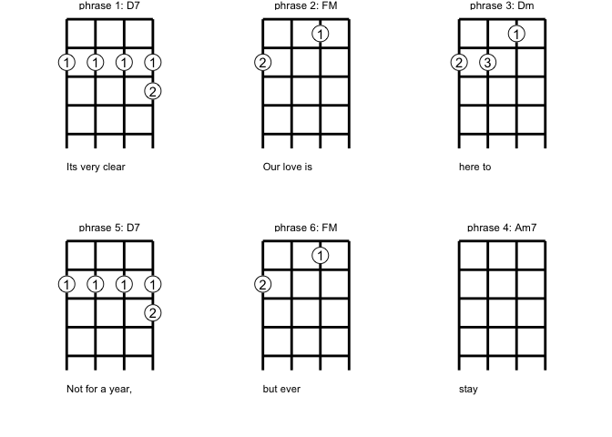<!-- -->

``` r
lyric_chord_df_to_chart(gershwin_ly_ch_df[7:12,] , bw = T)
```

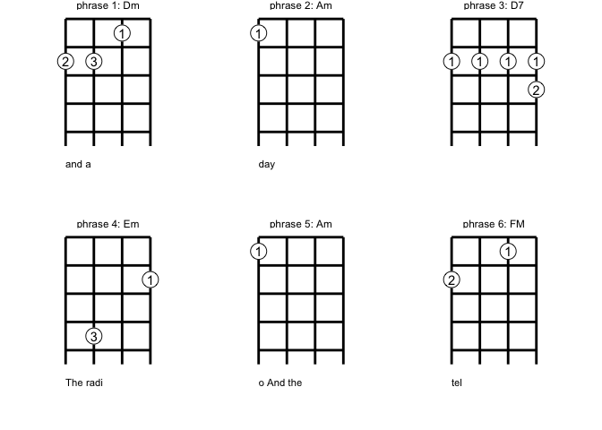<!-- -->

``` r
lyric_chord_df_to_chart(gershwin_ly_ch_df[13:18,], bw = T)
```

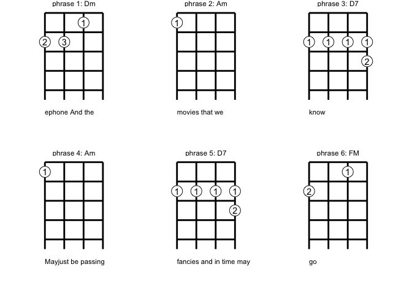<!-- -->

``` r
lyric_chord_df_to_chart(gershwin_ly_ch_df[19:24,], bw = T)
```

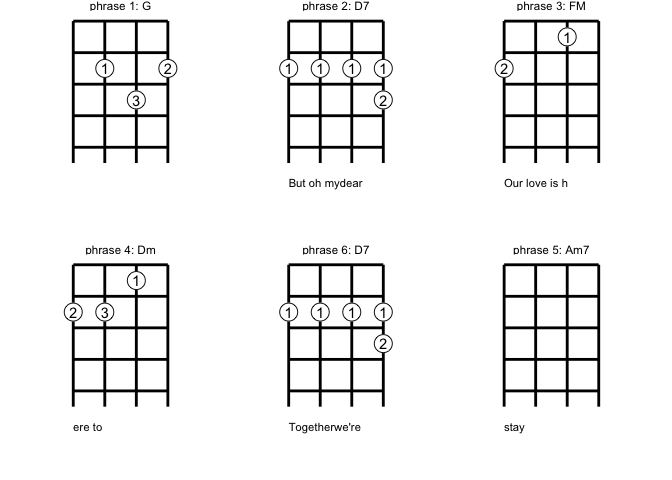<!-- -->

``` r
lyric_chord_df_to_chart(gershwin_ly_ch_df[25:30,], bw = T)
```

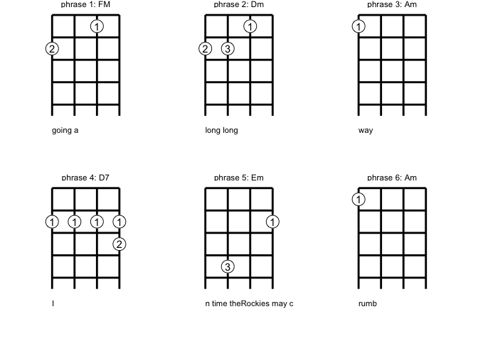<!-- -->

``` r
lyric_chord_df_to_chart(gershwin_ly_ch_df[31:36,], bw = T)
```

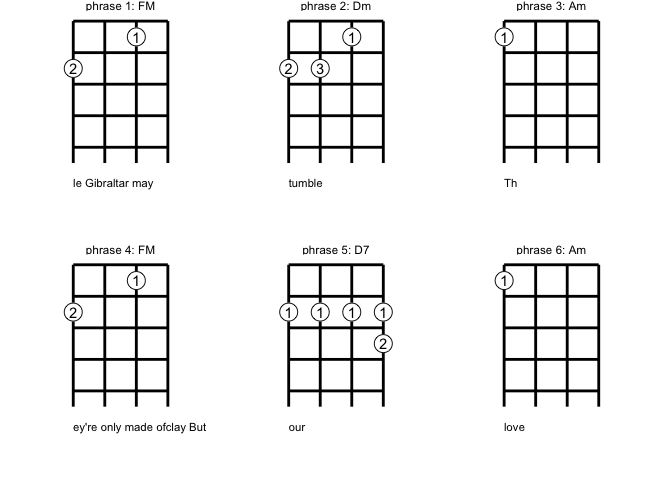<!-- -->

``` r
lyric_chord_df_to_chart(gershwin_ly_ch_df[37:38,], bw = T)
```

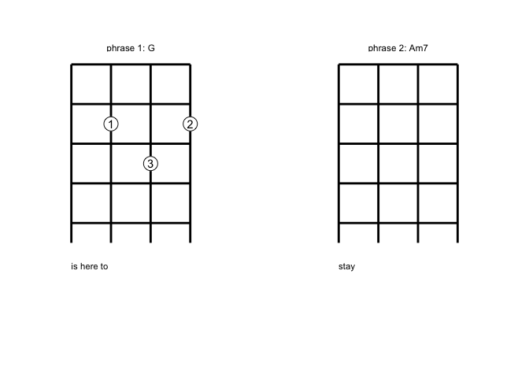<!-- -->

# Part II. Packaging and documentation 🚧 ✅

## Phase 1. Minimal working package

### Created files for **package archetecture** with `devtools::create(".")` ✅

### Moved **functions R folder**? ✅

``` r
knitr::knit_code$get() |> names()
#>  [1] "unnamed-chunk-1"           "cars"                     
#>  [3] "unnamed-chunk-2"           "unnamed-chunk-3"          
#>  [5] "unnamed-chunk-4"           "unnamed-chunk-5"          
#>  [7] "unnamed-chunk-6"           "uke_fretboard"            
#>  [9] "unnamed-chunk-7"           "unnamed-chunk-8"          
#> [11] "add_chord_fingering"       "unnamed-chunk-9"          
#> [13] "unnamed-chunk-10"          "add_lyric"                
#> [15] "unnamed-chunk-11"          "unnamed-chunk-12"         
#> [17] "unnamed-chunk-13"          "unnamed-chunk-14"         
#> [19] "unnamed-chunk-15"          "data"                     
#> [21] "unnamed-chunk-16"          "lyric_chord_df_to_chart"  
#> [23] "unnamed-chunk-17"          "unnamed-chunk-18"         
#> [25] "unnamed-chunk-19"          "unnamed-chunk-20"         
#> [27] "unnamed-chunk-21"          "unnamed-chunk-22"         
#> [29] "unnamed-chunk-23"          "unnamed-chunk-24"         
#> [31] "unnamed-chunk-25"          "unnamed-chunk-26"         
#> [33] "unnamed-chunk-27"          "unnamed-chunk-28"         
#> [35] "unnamed-chunk-29"          "test_calc_frequency_works"
#> [37] "unnamed-chunk-30"          "unnamed-chunk-31"         
#> [39] "unnamed-chunk-32"          "unnamed-chunk-33"         
#> [41] "unnamed-chunk-34"          "unnamed-chunk-35"
```

Use new {readme2pkg} function to do this from readme if you haven’t
already

``` r
# readme2pkg::chunk_to_r("")
```

### Added **roxygen skeleton**? 🚧

Use a roxygen skeleton for auto documentation and making sure proposed
functions are *exported*.

We haven’t done this which means none of the functions are exported. To
access them we need to use ‘gguke:::’ syntax.

### Managed **dependencies** ? ✅

Package dependencies managed, i.e. `depend::function()` in proposed
functions and declared in the DESCRIPTION

``` r
usethis::use_package("ggplot2")
#> • Refer to functions with `ggplot2::fun()`
usethis::use_package("dplyr")
#> • Refer to functions with `dplyr::fun()`
```

### Chosen a package **license**? 🚧

``` r
usethis::use_mit_license()
```

### Run `devtools::check()` and addressed errors? 🚧

``` r
devtools::check(pkg = ".")
#> ℹ Updating gguke documentation
#> ℹ Loading gguke
#> Error: R CMD check found WARNINGs
```

### Build package 🚧

``` r
devtools::build()
#> ── R CMD build ─────────────────────────────────────────────────────────────────
#> * checking for file ‘/Users/evangelinereynolds/Google Drive/r_packages/gguke/DESCRIPTION’ ... OK
#> * preparing ‘gguke’:
#> * checking DESCRIPTION meta-information ... OK
#> * checking for LF line-endings in source and make files and shell scripts
#> * checking for empty or unneeded directories
#> * building ‘gguke_0.0.0.9000.tar.gz’
#> [1] "/Users/evangelinereynolds/Google Drive/r_packages/gguke_0.0.0.9000.tar.gz"
```

You need to do this before Part 0 in this document will work.

### Make aspirational part of readme real. 🚧

At this point, you could change eval chunk options to TRUE. You can
remove the 🦄 emoji and perhaps replace it with construction site if you
are still uncertain of the API, and want to highlight that it is subject
to change.

### Add lifecycle badge (experimental)

``` r
usethis::use_lifecycle_badge("experimental")
```

## Phase 2: Listen & iterate 🚧

Try to get feedback from experts on API, implementation, default
decisions. Is there already work that solves this problem?

## Phase 3: Let things settle

### Settle on examples. Put them in the roxygen skeleton and readme. 🚧

### Written formal tests of functions? 🚧

That would look like this…

``` r
library(testthat)

test_that("calc frequency works", {
  expect_equal(calc_frequency("A", 0), 440)
  expect_equal(calc_frequency("A", -1), 220)
  
})
```

``` r
readme2pkg::chunk_to_tests_testthat("test_calc_frequency_works")
```

### Have you worked added a description and author information in the DESCRIPTION file? 🚧

### Addressed *all* notes, warnings and errors. 🚧

## Promote to wider audience…

### Package website built? 🚧

### Package website deployed? 🚧

## Phase 3: Harden/commit

### Submit to CRAN? Or don’t. 🚧

# Appendix: Reports, Environment

## Description file extract

## Environment

Here I just want to print the packages and the versions

``` r
all <- sessionInfo() |> print() |> capture.output()
all[11:17]
#> [1] ""                                                                         
#> [2] "attached base packages:"                                                  
#> [3] "[1] stats     graphics  grDevices utils     datasets  methods   base     "
#> [4] ""                                                                         
#> [5] "other attached packages:"                                                 
#> [6] " [1] gguke_0.0.0.9000     lubridate_1.9.2      forcats_1.0.0       "      
#> [7] " [4] stringr_1.5.0        dplyr_1.1.0          purrr_1.0.1         "
```

## `devtools::check()` report

``` r
devtools::check(pkg = ".")
#> ℹ Updating gguke documentation
#> ℹ Loading gguke
#> Error: R CMD check found WARNINGs
```

``` r
devtools::build(".")
#> ── R CMD build ─────────────────────────────────────────────────────────────────
#> * checking for file ‘/Users/evangelinereynolds/Google Drive/r_packages/gguke/DESCRIPTION’ ... OK
#> * preparing ‘gguke’:
#> * checking DESCRIPTION meta-information ... OK
#> * checking for LF line-endings in source and make files and shell scripts
#> * checking for empty or unneeded directories
#> * building ‘gguke_0.0.0.9000.tar.gz’
#> [1] "/Users/evangelinereynolds/Google Drive/r_packages/gguke_0.0.0.9000.tar.gz"
```

# test functions from package, use :: (or :::)

``` r
library(gguke)
data("Dm")

gguke:::uke_fretboard() + 
  gguke:::add_chord_fingering() + 
  gguke:::add_lyric()
```

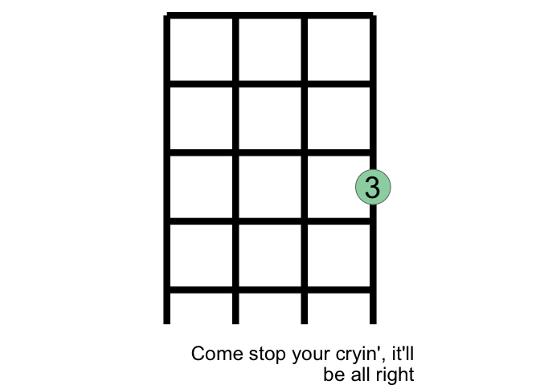<!-- -->

``` r


gguke:::uke_fretboard() + 
  gguke:::add_chord_fingering(Fsm) + 
  gguke:::add_lyric("a different lyric")
```

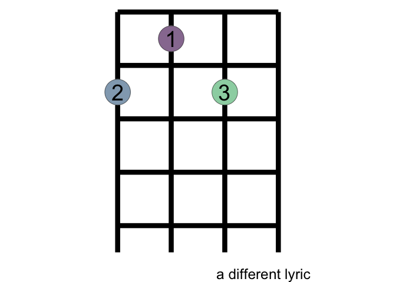<!-- -->

``` r

a_cool_song22 <- tibble::tribble(~lyric, ~chord_name,
                       "This is my cool lyric", "CM",
                       "This is another", "DM",
                       "hi", "GM",
                       "hola hola!", "E7M")


gguke:::lyric_chord_df_to_chart(a_cool_song22)
```

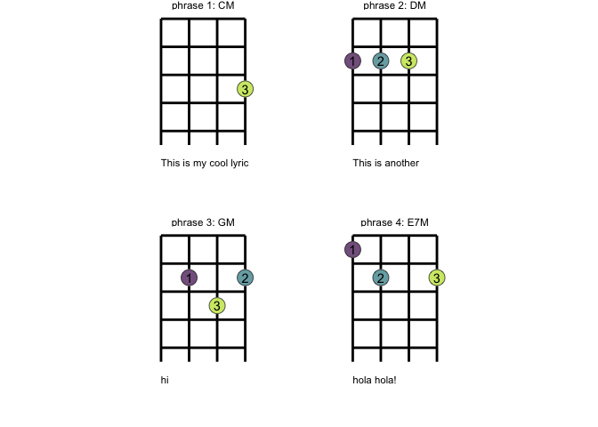<!-- -->
