<!-- README.md is generated from README.Rmd. Please edit that file -->

# gguke

<!-- badges: start -->

[](https://lifecycle.r-lib.org/articles/stages.html#experimental)
<!-- badges: end -->

{gguke} will provide tools for visualizing ukelele chords with lyrics.
This is for people that aren’t so good at ukelele; they may not really
know the chords yet. It’s a chord-first approach to song charts, which
might have only chord names or small finger position.

And because we make it with ggplot2, we can do a lot with customization.
For example, fingers get assigned a color using the viridis palette.

This is currently a [{readme2pkg}]() project; we’re writing in a kind-of
stream of consciousness way, bundling up useful code into functions as
we go in our README.rmd narrative, and then sending written-up functions
to our R folder with knitr/rmd magic. Our commitment to keeping things
as they are is low at this point, but it is a real package. Lifecycle is
*early* experimental. See also [{litr}]().

Beyond the descriptions of our work, we interject comments on our
hesitations 🤔 and areas that need some work 🚧, for your consideration
marked with emoji.

### First, something I’m very excited about, a chord ingestion proposal…\!

``` r
CM <- 
"pppp
----
----
---3"


library(tidyverse)
#> ── Attaching core tidyverse packages ─────────────────── tidyverse 2.0.0.9000 ──
#> ✔ dplyr     1.1.0          ✔ readr     2.1.4     
#> ✔ forcats   1.0.0          ✔ stringr   1.5.0     
#> ✔ ggplot2   3.4.4.9000     ✔ tibble    3.2.1     
#> ✔ lubridate 1.9.2          ✔ tidyr     1.3.0     
#> ✔ purrr     1.0.1          
#> ── Conflicts ────────────────────────────────────────── tidyverse_conflicts() ──
#> ✖ dplyr::filter() masks stats::filter()
#> ✖ dplyr::lag()    masks stats::lag()
#> ℹ Use the conflicted package (<http://conflicted.r-lib.org/>) to force all conflicts to become errors
```

### Then translate that to data frame that records string, fret, and finger that will play each note.

``` r
parse_chord <- function(chord = CM){

play_TF <- chord |> stringr::str_split("") %>%  .[[1]] %>% .[1:4]

chart <- chord |> stringr::str_split("") %>%  .[[1]] %>% .[5:length(.)] 
num_frets <- length(chart)/5
string <- rep(1:4, num_frets)
fret <- sort(rep(1:num_frets, 4))

data.frame(finger = chart) %>% 
  dplyr::filter(finger != "\n") %>% 
  dplyr::mutate(fret = fret) %>% 
  dplyr::mutate(string = string) %>% 
  dplyr::mutate(finger = ifelse(.data$finger == "-", NA, finger) %>% as.numeric()) %>% 
  dplyr::filter(!is.na(finger)) ->
fingering_df

list(play_tf = play_TF, 
     fingering_df = fingering_df)

}
```

``` r

# play or not for each string
parse_chord()[[1]]
#> [1] "p" "p" "p" "p"

# dataframe with finger placement info
parse_chord()[[2]]
#>   finger fret string
#> 1      3    3      4
```

🤔 maybe read.delim(delim = ""), would work better and feel more grokable
that this string split business\! :-)

``` r
usethis::use_pipe()
#> ✔ Setting active project to '/Users/evangelinereynolds/Google
#> Drive/r_packages/gguke'
readme2pkg::chunk_to_r("parse_chord")
```

# then we make a fret board.

``` r
library(ggplot2)
ggplot() + 
  annotate(geom = "segment", x = 1:4, y = .5, 
           xend = 1:4, yend = 5, linewidth = 3) + 
  annotate(geom = "segment", y = 0:4 +.5, 
           yend = 0:4 +.5, x = 1, xend = 4, linewidth = 3) + 
  scale_y_reverse() + 
  scale_x_continuous(expand = expansion(.2)) +
  theme_void() + 
  coord_equal() +
  scale_fill_viridis_c(limits = c(1,4), guide = F)
#> Warning: The `guide` argument in `scale_*()` cannot be `FALSE`. This was deprecated in
#> ggplot2 3.3.4.
#> ℹ Please use "none" instead.
#> This warning is displayed once every 8 hours.
#> Call `lifecycle::last_lifecycle_warnings()` to see where this warning was
#> generated.
```

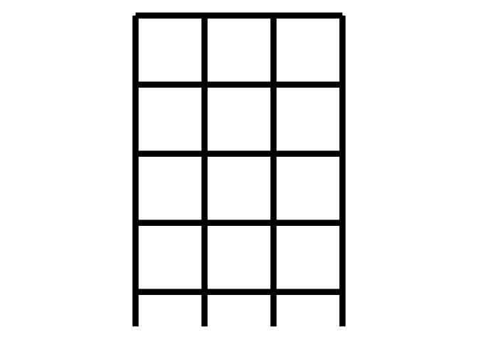<!-- -->

``` r
uke_fretboard <- function(){
  
  ggplot() + 
  annotate(geom = "segment", x = 1:4, y = .5, 
           xend = 1:4, yend = 5, linewidth = 3) + 
  annotate(geom = "segment", y = 0:4 +.5, 
           yend = 0:4 +.5, x = 1, xend = 4, linewidth = 3) + 
  scale_y_reverse() + 
  scale_x_continuous(expand = expansion(.2)) +
  theme_void() + 
  coord_equal() +
  scale_fill_viridis_c(limits = c(1,4), guide = F) 
  
}
```

🤔 maybe gguke() would be better 🤔 maybe a coord\_uke could be a
long-term goal.

``` r
readme2pkg::chunk_to_r("uke_fretboard")
```

## now we’ll place fingers positions w/ point and text

``` r
uke_fretboard() + 
  geom_point(data = parse_chord()[[2]],
             size = 15, 
             aes(x = string, y = fret),
             color = "white"
             ) +
  geom_point(data = parse_chord()[[2]],
             size = 15, pch = 21, alpha = .6,
             aes(x = string, y = fret,
                 fill = finger), 
             ) +
  geom_text(data = parse_chord()[[2]],
             size = 10,
             aes(x = string, y = fret, label = finger)
             )
```

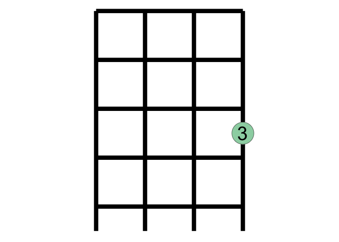<!-- -->

### looks great\! Make a function

``` r
add_chord_fingering <- function(chord = CM){
  
   list(  geom_point(data = parse_chord(chord)[[2]],
             size = 15,
             aes(x = string, y = fret),
             color = "white"
             ) ,
  geom_point(data = parse_chord(chord)[[2]],
             size = 15, pch = 21, alpha = .6,
             aes(x = string, y = fret,
                 fill = finger),
             ) ,
  geom_text(data = parse_chord(chord)[[2]],
             size = 10,
             aes(x = string, y = fret, label = finger)
             )
   )
}
```

``` r
readme2pkg::chunk_to_r("add_chord_fingering")
```

## Okay, we want to pair lyrics with the chord

``` r
uke_fretboard() +
  add_chord_fingering() +
  labs(caption = "Come stop your cryin', it'll be all right" %>% str_wrap(28)) + 
  theme(text = element_text(size = 23))
```

<!-- -->

### looks good… make it a function\!

``` r

add_lyric <- function(lyric = "Come stop your cryin', it'll be all right"){
  
    list(labs(caption = lyric %>% str_wrap(28)),
         theme(text = element_text(size = 23)))
  
  
}
```

``` r
readme2pkg::chunk_to_r("add_lyric")
```

### try it out…

``` r
uke_fretboard() + 
  add_chord_fingering(CM) + 
  add_lyric("Just take my hand and hold it tight")
```

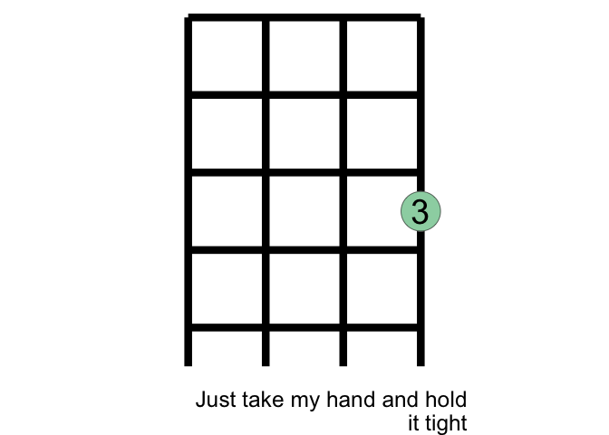<!-- -->

### and with new chord input

``` r

FM <- 
"pppp
--1-
2---
----"

uke_fretboard() + 
  add_chord_fingering(FM) + 
  add_lyric("I will protect you from all around you")
```

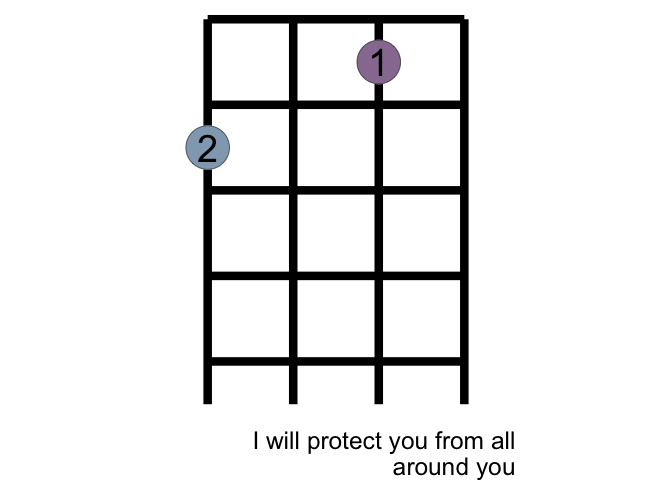<!-- -->

# and a bunch more chords and lyrics\!

``` r
Dm <- 
"pppp
--1-
23--
----"


uke_fretboard() + 
  add_chord_fingering(Dm) + 
  add_lyric("I will be here don't you ...")
```

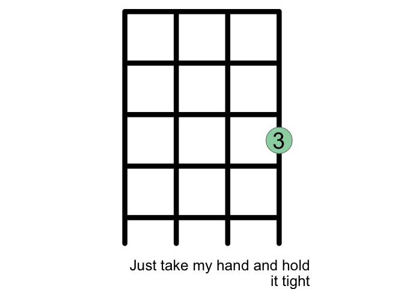<!-- -->

``` r


GM <- 
"pppp
----
-1-2
--3-"


uke_fretboard() + 
  add_chord_fingering(GM) + 
  add_lyric(" ... cry")
```

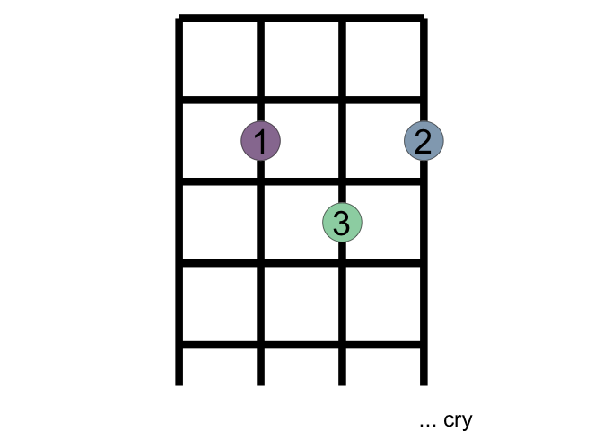<!-- -->

``` r


uke_fretboard() + 
  add_chord_fingering(CM) + 
  add_lyric("For one so small, you seem so strong")
```

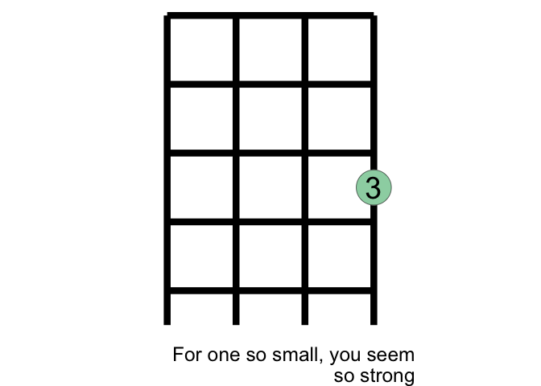<!-- -->

``` r

uke_fretboard() + 
  add_chord_fingering(CM) + 
  add_lyric("My arms will hold you keep you safe and warm")
```

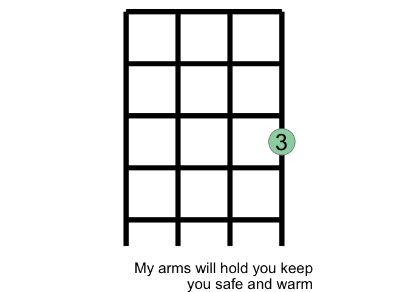<!-- -->

``` r


uke_fretboard() + 
  add_chord_fingering(FM) + 
  add_lyric("This bond between us can't be broken")
```

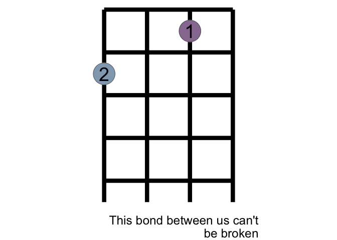<!-- -->

``` r


uke_fretboard() + 
  add_chord_fingering(Dm) + 
  add_lyric("I will be here don't you ...")
```

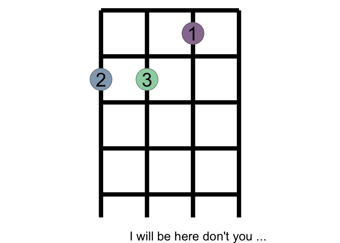<!-- -->

``` r

uke_fretboard() + 
  add_chord_fingering(GM) + 
  add_lyric("... cry")
```

<!-- -->

``` r

E7M <- 
"pppp
1---
-2-3
----"

uke_fretboard() + 
  add_chord_fingering(E7M) + 
  add_lyric("... ")
```

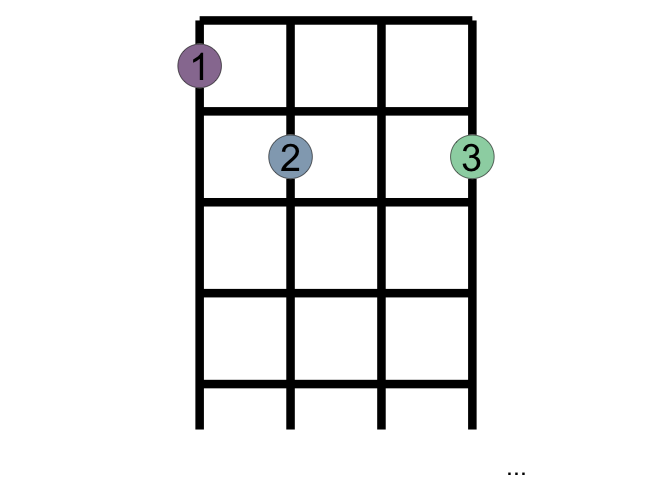<!-- -->

``` r


AM <- 
"pppp
-1--
2---
----"

uke_fretboard() + 
  add_chord_fingering(AM) + 
  add_lyric("You'll be in my ...")
```

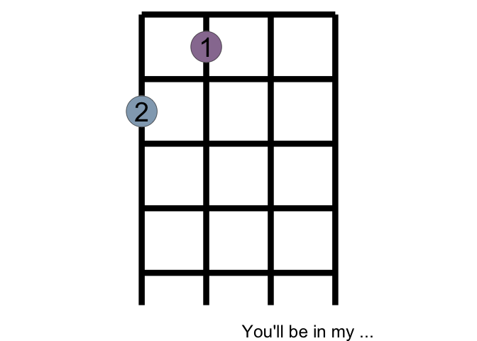<!-- -->

``` r


DM <- 
"pppp
----
123-
----"

uke_fretboard() + 
  add_chord_fingering(DM) + 
  add_lyric("... heart")
```

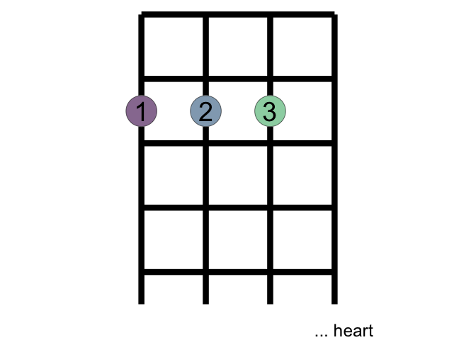<!-- -->

``` r

uke_fretboard() + 
  add_chord_fingering(E7M) + 
  add_lyric("You'll be in my ...")
```

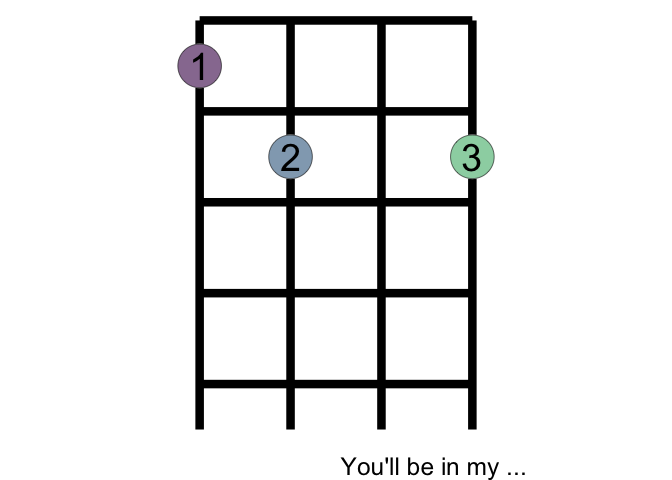<!-- -->

``` r


Dbm <- 
"pppp
12--
----
----"


uke_fretboard() + 
  add_chord_fingering(Dbm) + 
  add_lyric(" ... heart")
```

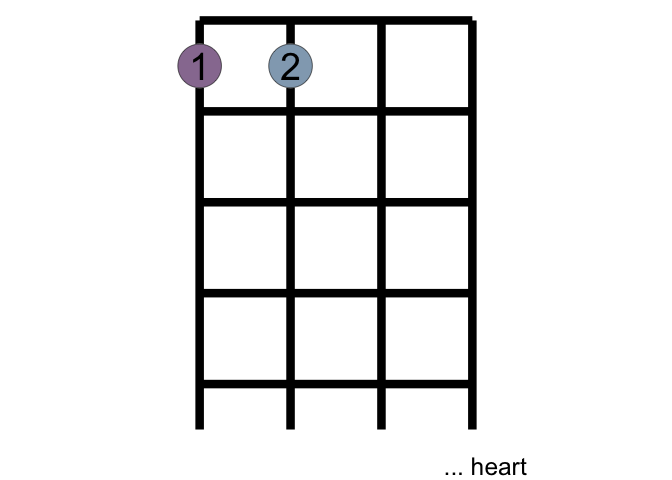<!-- -->

``` r

uke_fretboard() + 
  add_chord_fingering(AM)  + 
  add_lyric("From this day on ")
```

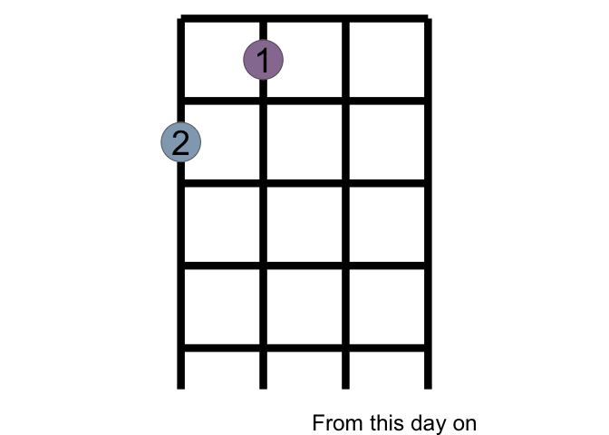<!-- -->

``` r


uke_fretboard() + 
  add_chord_fingering(DM)  + 
  add_lyric("Now and forever")
```

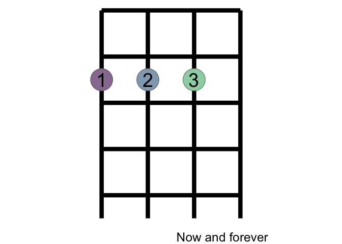<!-- -->

``` r


uke_fretboard() + 
  add_chord_fingering(GM)  + 
  add_lyric(" ... more")
```

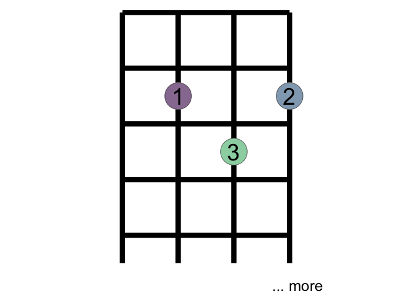<!-- -->

``` r

uke_fretboard() + 
  add_chord_fingering(E7M)  + 
  add_lyric(" ...")
```

<!-- -->

``` r

###################


Fsm <- 
"pppp
-1--
2-3-
----"


uke_fretboard() + 
  add_chord_fingering(Fsm)
```

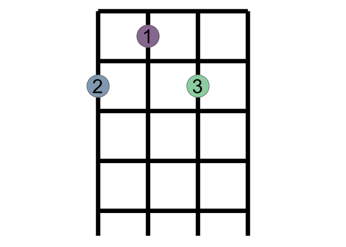<!-- -->

``` r

uke_fretboard() + 
  add_chord_fingering(GM)
```

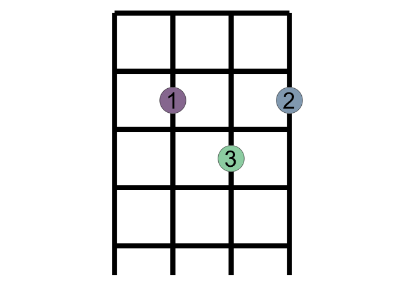<!-- -->

## Lets include the chords as data in the package

``` r
usethis::use_data(CM, overwrite = T)
#> ✔ Saving 'CM' to 'data/CM.rda'
#> • Document your data (see 'https://r-pkgs.org/data.html')
usethis::use_data(FM, overwrite = T)
#> ✔ Saving 'FM' to 'data/FM.rda'
#> • Document your data (see 'https://r-pkgs.org/data.html')
usethis::use_data(Dm, overwrite = T)
#> ✔ Saving 'Dm' to 'data/Dm.rda'
#> • Document your data (see 'https://r-pkgs.org/data.html')
usethis::use_data(GM, overwrite = T)
#> ✔ Saving 'GM' to 'data/GM.rda'
#> • Document your data (see 'https://r-pkgs.org/data.html')
usethis::use_data(E7M, overwrite = T)
#> ✔ Saving 'E7M' to 'data/E7M.rda'
#> • Document your data (see 'https://r-pkgs.org/data.html')
usethis::use_data(AM, overwrite = T)
#> ✔ Saving 'AM' to 'data/AM.rda'
#> • Document your data (see 'https://r-pkgs.org/data.html')
usethis::use_data(DM, overwrite = T)
#> ✔ Saving 'DM' to 'data/DM.rda'
#> • Document your data (see 'https://r-pkgs.org/data.html')
usethis::use_data(Dbm, overwrite = T)
#> ✔ Saving 'Dbm' to 'data/Dbm.rda'
#> • Document your data (see 'https://r-pkgs.org/data.html')
usethis::use_data(Fsm, overwrite = T)
#> ✔ Saving 'Fsm' to 'data/Fsm.rda'
#> • Document your data (see 'https://r-pkgs.org/data.html')
```

``` r
"CM"
#> [1] "CM"
"FM"
#> [1] "FM"
"Dm"
#> [1] "Dm"
"GM"
#> [1] "GM"
"E7M"
#> [1] "E7M"
"AM"
#> [1] "AM"
"DM"
#> [1] "DM"
"Dbm"
#> [1] "Dbm"
```

# next steps…

``` r
library(tidyverse)
library(gguke)
lyric_chord_df <- tibble::tribble(~lyric, ~chord_name,
        "Come stop your cryin', it'll be all right", "CM",
"Just take my hand, hold it tight", "CM",
"I will protect you, from all around you", "FM",
"I will be here, don't you ","Dm",
"...cry" , "GM" )

parse_chord2 <- function(chord){parse_chord(chord)[[2]]}

Dm
#> [1] "pppp\n--1-\n23--\n----"
lyric_chord_df %>% 
  mutate(phrase = row_number()) %>% 
  mutate(fingering_str = map(chord_name, get)) %>% 
  unnest(cols = c(fingering_str)) %>% 
  mutate(fingering = map(fingering_str, parse_chord2)) %>% 
  unnest(cols = c(fingering)) %>% 
  ggplot() +
  annotate(geom = "segment", x = 1:4, y = .5, 
           xend = 1:4, yend = 5, linewidth = 1) + 
  annotate(geom = "segment", y = 0:4 +.5, 
           yend = 0:4 +.5, x = 1, xend = 4, linewidth = 1) +
  aes(x = string, y = fret, label = finger) + 
  geom_point(size = 6, color = "white") +
  geom_point(size = 6, pch= 21, aes(fill = finger), alpha = .7 , show.legend = F) +
  geom_text() +
  facet_wrap(~ paste0("phrase ", phrase,": ", chord_name) %>% fct_inorder()) + 
  geom_text(data = . %>% select(phrase, lyric, chord_name) %>% distinct(),
            x = 1, y = -5.5, size = 3,
            aes(label = lyric %>% str_wrap(28)),
            hjust = 0,
            vjust = 1) + 
  scale_y_reverse(limits = c(7, .5)) + 
  coord_equal() + 
  scale_fill_viridis_c(end = .9) + 
  scale_x_continuous(expand = expansion(.6)) + 
  theme_void()
```

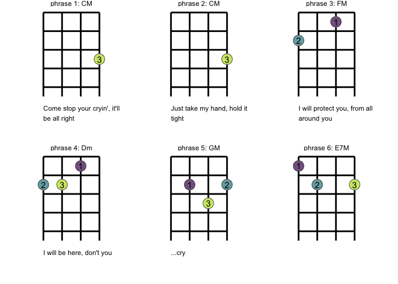<!-- -->

``` r


uke_fretboard
#> function(){
#>   
#>   ggplot() + 
#>   annotate(geom = "segment", x = 1:4, y = .5, 
#>            xend = 1:4, yend = 5, linewidth = 3) + 
#>   annotate(geom = "segment", y = 0:4 +.5, 
#>            yend = 0:4 +.5, x = 1, xend = 4, linewidth = 3) + 
#>   scale_y_reverse() + 
#>   scale_x_continuous(expand = expansion(.2)) +
#>   theme_void() + 
#>   coord_equal() +
#>   scale_fill_viridis_c(limits = c(1,4), guide = F) 
#>   
#> }
#> <bytecode: 0x7fc82756ba68>
```

# Part II. Packaging and documentation 🚧 ✅

## Phase 1. Minimal working package

### Created files for package archetecture with `devtools::create(".")` ✅

### Moved functions R folder? ✅

``` r
knitr::knit_code$get() |> names()
#>  [1] "unnamed-chunk-1"           "cars"                     
#>  [3] "unnamed-chunk-2"           "unnamed-chunk-3"          
#>  [5] "unnamed-chunk-4"           "unnamed-chunk-5"          
#>  [7] "uke_fretboard"             "unnamed-chunk-6"          
#>  [9] "unnamed-chunk-7"           "add_chord_fingering"      
#> [11] "unnamed-chunk-8"           "unnamed-chunk-9"          
#> [13] "add_lyric"                 "unnamed-chunk-10"         
#> [15] "unnamed-chunk-11"          "unnamed-chunk-12"         
#> [17] "unnamed-chunk-13"          "unnamed-chunk-14"         
#> [19] "data"                      "unnamed-chunk-15"         
#> [21] "unnamed-chunk-16"          "unnamed-chunk-17"         
#> [23] "unnamed-chunk-18"          "unnamed-chunk-19"         
#> [25] "unnamed-chunk-20"          "unnamed-chunk-21"         
#> [27] "unnamed-chunk-22"          "test_calc_frequency_works"
#> [29] "unnamed-chunk-23"          "unnamed-chunk-24"         
#> [31] "unnamed-chunk-25"          "unnamed-chunk-26"         
#> [33] "unnamed-chunk-27"          "unnamed-chunk-28"
```

Use new {readme2pkg} function to do this from readme if you haven’t
already

``` r
readme2pkg::chunk_to_r("")
```

### Added roxygen skeleton? ✅

Use a roxygen skeleton for auto documentation and making sure proposed
functions are *exported*.

### Managed dependencies ? ✅

Package dependencies managed, i.e. `depend::function()` in proposed
functions and declared in the DESCRIPTION

``` r
usethis::use_package("ggplot2")
#> • Refer to functions with `ggplot2::fun()`
usethis::use_package("dplyr")
#> • Refer to functions with `dplyr::fun()`
```

### Chosen a license? ✅

``` r
usethis::use_mit_license()
```

### Run `devtools::check()` and addressed errors? ✅

``` r
devtools::check(pkg = ".")
#> ℹ Updating gguke documentation
#> ℹ Loading gguke
#> Error: R CMD check found WARNINGs
```

### Build package 🚧

``` r
devtools::build()
#> ── R CMD build ─────────────────────────────────────────────────────────────────
#> * checking for file ‘/Users/evangelinereynolds/Google Drive/r_packages/gguke/DESCRIPTION’ ... OK
#> * preparing ‘gguke’:
#> * checking DESCRIPTION meta-information ... OK
#> * checking for LF line-endings in source and make files and shell scripts
#> * checking for empty or unneeded directories
#> * building ‘gguke_0.0.0.9000.tar.gz’
#> [1] "/Users/evangelinereynolds/Google Drive/r_packages/gguke_0.0.0.9000.tar.gz"
```

You need to do this before Part 0 in this document will work.

### Make aspirational part of readme real. 🚧

At this point, you could change eval chunk options to TRUE. You can
remove the 🦄 emoji and perhaps replace it with construction site if you
are still uncertain of the API, and want to highlight that it is subject
to change.

### Add lifecycle badge (experimental)

``` r
usethis::use_lifecycle_badge("experimental")
```

## Phase 2: Listen & iterate 🚧

Try to get feedback from experts on API, implementation, default
decisions. Is there already work that solves this problem?

## Phase 3: Let things settle

### Settle on examples. Put them in the roxygen skeleton and readme. 🚧

### Written formal tests of functions? 🚧

That would look like this…

``` r
library(testthat)

test_that("calc frequency works", {
  expect_equal(calc_frequency("A", 0), 440)
  expect_equal(calc_frequency("A", -1), 220)
  
})
```

``` r
readme2pkg::chunk_to_tests_testthat("test_calc_frequency_works")
```

### Have you worked added a description and author information in the DESCRIPTION file? 🚧

### Addressed *all* notes, warnings and errors. 🚧

## Promote to wider audience…

### Package website built? 🚧

### Package website deployed? 🚧

## Phase 3: Harden/commit

### Submit to CRAN? Or don’t. 🚧

# Appendix: Reports, Environment

## Description file extract

## Environment

Here I just want to print the packages and the versions

``` r
all <- sessionInfo() |> print() |> capture.output()
all[11:17]
#> [1] ""                                                                         
#> [2] "attached base packages:"                                                  
#> [3] "[1] stats     graphics  grDevices utils     datasets  methods   base     "
#> [4] ""                                                                         
#> [5] "other attached packages:"                                                 
#> [6] " [1] gguke_0.0.0.9000     lubridate_1.9.2      forcats_1.0.0       "      
#> [7] " [4] stringr_1.5.0        dplyr_1.1.0          purrr_1.0.1         "
```

## `devtools::check()` report

``` r
devtools::check(pkg = ".")
#> ℹ Updating gguke documentation
#> ℹ Loading gguke
#> Error: R CMD check found WARNINGs
```

``` r
devtools::build(".")
#> ── R CMD build ─────────────────────────────────────────────────────────────────
#> * checking for file ‘/Users/evangelinereynolds/Google Drive/r_packages/gguke/DESCRIPTION’ ... OK
#> * preparing ‘gguke’:
#> * checking DESCRIPTION meta-information ... OK
#> * checking for LF line-endings in source and make files and shell scripts
#> * checking for empty or unneeded directories
#> * building ‘gguke_0.0.0.9000.tar.gz’
#> [1] "/Users/evangelinereynolds/Google Drive/r_packages/gguke_0.0.0.9000.tar.gz"
```

# test functions from package, use :: (or :::)

``` r
library(gguke)
Fsm
#> [1] "pppp\n-1--\n2-3-\n----"

gguke:::uke_fretboard() + 
  gguke:::add_chord_fingering() + 
  gguke:::add_lyric()
```

<!-- -->

``` r


gguke:::uke_fretboard() + 
  gguke:::add_chord_fingering(Fsm) + 
  gguke:::add_lyric("a different lyric")
```

<!-- -->
