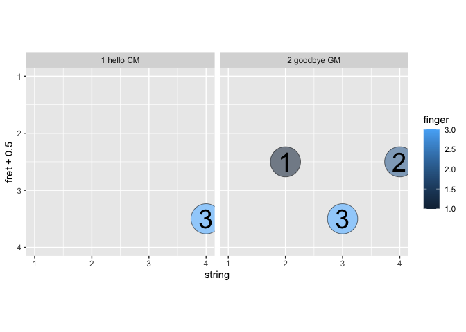
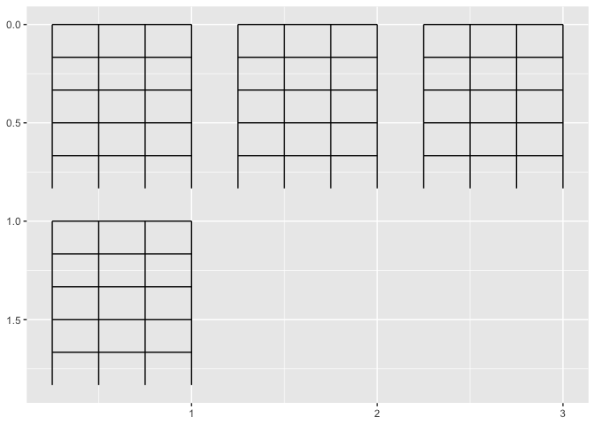

- [gguke is under construction! 🚧 Feedback
  welcome!](#gguke-is-under-construction--feedback-welcome)
  - [**Chord info input**](#chord-info-input)
  - [Build up slightly larger **chord
    library**](#build-up-slightly-larger-chord-library)
    - [Translate finger_str to fret, finger, string
      info](#translate-finger_str-to-fret-finger-string-info)
    - [Make it a function…](#make-it-a-function)
- [use parsing to expand dataframe to have row per finger
  placement.](#use-parsing-to-expand-dataframe-to-have-row-per-finger-placement)
  - [now we’ll place **fingers positions** w/ point and
    text](#now-well-place-fingers-positions-w-point-and-text)
  - [Part I.b](#part-ib)
    - [step 1. computation (will be left join of a chord
      library)](#step-1-computation-will-be-left-join-of-a-chord-library)
    - [step 2. pass to ggproto](#step-2-pass-to-ggproto)
- [write layer](#write-layer)
  - [then we need a **fret board**.](#then-we-need-a-fret-board)
  - [move away from using facet](#move-away-from-using-facet)
    - [step 3. update geom_chord/stat chord with position
      wrap](#step-3-update-geom_chordstat-chord-with-position-wrap)
- [maybe a position that wraps by
  row](#maybe-a-position-that-wraps-by-row)
  - [and geom Lyric](#and-geom-lyric)
  - [from **lyric-chord data frame to
    chart**…](#from-lyric-chord-data-frame-to-chart)
    - [use a lyrics-chord data frame.](#use-a-lyrics-chord-data-frame)
  - [from text to chord-lyric data frame (w/ let it
    snow)](#from-text-to-chord-lyric-data-frame-w-let-it-snow)
  - [gershwin](#gershwin)

<!-- README.md is generated from README.Rmd. Please edit that file -->

# gguke is under construction! 🚧 Feedback welcome!

<!-- badges: start -->

[](https://lifecycle.r-lib.org/articles/stages.html#experimental)

<!-- badges: end -->

{gguke} will provide tools for visualizing ukelele chords with lyrics.
This is for people that aren’t so good at ukelele; they may not really
know the chords yet. It’s a chord-first approach to song charts, which
might have only chord names or small finger position.

And because we make it with ggplot2, we can do a lot with customization.
For example, fingers get assigned a color using the viridis palette.

This is currently a [{knitrExtra}]() project; we’re writing in a kind-of
stream of consciousness way, bundling up useful code into functions as
we go in our README.rmd narrative, and then sending written-up functions
to our R folder with knitr/rmd magic. Our commitment to keeping things
as they are is low at this point, but it is a real package. Lifecycle is
*early* experimental. See also [{litr}]().

Beyond the descriptions of our work, we interject comments on our
hesitations 🤔 and areas that need some work 🚧, for your consideration
marked with emoji.

## **Chord info input**

First, something I’m very excited about, a new-chord ingestion… - it’s
just text. Here’s a C major fingering, where first line is whether
string is played or not. There are four strings across, the number
indicates where on the fret board the specific finger should be placed:

``` r
CM <- 
"pppp
----
----
---3"

GM <- 
"pppp
----
-1-2
--3-"

chord_library <- data.frame(chord_name = 
                              c("CM", "GM"),
                            fingering_str = 
                              c(CM, GM)) 

chord_library
#>   chord_name          fingering_str
#> 1         CM pppp\n----\n----\n---3
#> 2         GM pppp\n----\n-1-2\n--3-
```

## Build up slightly larger **chord library**

``` r
# easy to write
Dm <- 
"pppp
--1-
23--
----"

EM <- 
"pppp
1---
---2
----
-4--"

FM <- 
"pppp
--1-
2---
----"

# re-writen to save space
GM <- "pppp\n----\n-1-2\n--3-"
E7M <- "pppp\n1---\n-2-3\n----"
AM <- "pppp\n-1--\n2---\n----"
DM <- "pppp\n----\n123-\n----"
Dbm <- "pppp\n12--\n----\n----"
`F#m` <- "pppp\n-1--\n2-3-\n----"
D7M <- "pppp\n----\n1111\n---2"
A7M <- "pppp\n-1--\n----\n----"
Am <- "pppp\n----\n2---\n----"
Am7 <- "pppp\n----\n----\n----"
Bm <- "pppp\n----\n-111\n----\n3---"
Em <- "pppp\n----\n---1\n----\n-3--"
```

``` r
chord_library <- tibble(chord_name = 
c("CM", "GM", "Dm", "E7M", "AM","DM", "Dbm", "F#m", "D7M", "A7M", "Am", "Am7", "Bm", "Em", "EM", "FM"),
fingering_str = 
c(CM, GM, Dm, E7M, AM, DM, Dbm, `F#m`, D7M, A7M, Am, Am7, Bm, Em, EM, FM))
chord_library
#> # A tibble: 16 × 2
#>    chord_name fingering_str                 
#>    <chr>      <chr>                         
#>  1 CM         "pppp\n----\n----\n---3"      
#>  2 GM         "pppp\n----\n-1-2\n--3-"      
#>  3 Dm         "pppp\n--1-\n23--\n----"      
#>  4 E7M        "pppp\n1---\n-2-3\n----"      
#>  5 AM         "pppp\n-1--\n2---\n----"      
#>  6 DM         "pppp\n----\n123-\n----"      
#>  7 Dbm        "pppp\n12--\n----\n----"      
#>  8 F#m        "pppp\n-1--\n2-3-\n----"      
#>  9 D7M        "pppp\n----\n1111\n---2"      
#> 10 A7M        "pppp\n-1--\n----\n----"      
#> 11 Am         "pppp\n----\n2---\n----"      
#> 12 Am7        "pppp\n----\n----\n----"      
#> 13 Bm         "pppp\n----\n-111\n----\n3---"
#> 14 Em         "pppp\n----\n---1\n----\n-3--"
#> 15 EM         "pppp\n1---\n---2\n----\n-4--"
#> 16 FM         "pppp\n--1-\n2---\n----"
```

### Translate finger_str to fret, finger, string info

Then translate that to data frame that records string, fret, and finger
that will play each note. I’m just doing the first thing that came to
mind - some string manipulation, but might move to read.delim…

``` r

CM |> stringr::str_split("") %>%  .[[1]] %>% .[1:4]
#> [1] "p" "p" "p" "p"

chart <- CM |> stringr::str_split("") %>%  .[[1]] %>% .[5:length(.)] 
num_frets <- length(chart)/5
string <- rep(1:4, num_frets)
fret <- sort(rep(1:num_frets, 4))

data.frame(finger = chart) %>% 
  dplyr::filter(finger != "\n") %>% 
  dplyr::mutate(fret = fret) %>% 
  dplyr::mutate(string = string) %>% 
  dplyr::mutate(finger = ifelse(.data$finger == "-", NA, finger) %>% as.numeric()) %>% 
  dplyr::filter(!is.na(finger)) 
#>   finger fret string
#> 1      3    3      4
```

🤔 maybe read.delim(delim = ““), would work better and feel more
grokable that this string split business! :-)

### Make it a function…

``` r
parse_chord <- function(chord = CM){

play_TF <- chord |> stringr::str_split("") %>%  .[[1]] %>% .[1:4]

chart <- chord |> stringr::str_split("") %>%  .[[1]] %>% .[5:length(.)] 
num_frets <- length(chart)/5
string <- rep(1:4, num_frets)
fret <- sort(rep(1:num_frets, 4))

data.frame(finger = chart) %>% 
  dplyr::filter(finger != "\n") %>% 
  dplyr::mutate(fret = fret) %>% 
  dplyr::mutate(string = string) %>% 
  dplyr::mutate(finger = ifelse(.data$finger == "-", NA, finger) %>% as.numeric()) %>% 
  dplyr::filter(!is.na(finger)) ->
fingering_df

list(play_tf = play_TF, 
     fingering_df = fingering_df)

}
```

``` r

# play or not for each string
parse_chord()[[1]]
#> [1] "p" "p" "p" "p"

# dataframe with finger placement info
parse_chord()[[2]]
#>   finger fret string
#> 1      3    3      4
```

# use parsing to expand dataframe to have row per finger placement.

``` r
parse_chord_fingering <- function(chord){
  
  parse_chord(chord)[[2]]
  
}

chord_library_parse_chords <- function(chord_library){

parsed_chords <- list()

for (i in 1:nrow(chord_library)){
  
  parsed_chords[[i]] <- parse_chord_fingering(chord_library$fingering_str[i])
  
}

chord_library$phrase_chord_id <- 1:nrow(chord_library)
chord_library$parsed_chords <- parsed_chords

chord_library %>% 
  unnest(parsed_chords)

}
```

``` r
chord_library_parsed <- chord_library %>% chord_library_parse_chords() 

chord_library_parsed
#> # A tibble: 38 × 6
#>    chord_name fingering_str            phrase_chord_id finger  fret string
#>    <chr>      <chr>                              <int>  <dbl> <int>  <int>
#>  1 CM         "pppp\n----\n----\n---3"               1      3     3      4
#>  2 GM         "pppp\n----\n-1-2\n--3-"               2      1     2      2
#>  3 GM         "pppp\n----\n-1-2\n--3-"               2      2     2      4
#>  4 GM         "pppp\n----\n-1-2\n--3-"               2      3     3      3
#>  5 Dm         "pppp\n--1-\n23--\n----"               3      1     1      3
#>  6 Dm         "pppp\n--1-\n23--\n----"               3      2     2      1
#>  7 Dm         "pppp\n--1-\n23--\n----"               3      3     2      2
#>  8 E7M        "pppp\n1---\n-2-3\n----"               4      1     1      1
#>  9 E7M        "pppp\n1---\n-2-3\n----"               4      2     2      2
#> 10 E7M        "pppp\n1---\n-2-3\n----"               4      3     2      4
#> # ℹ 28 more rows
```

``` r
usethis::use_pipe()
knitrExtra:::chunk_to_r("parse_chord")
```

## now we’ll place **fingers positions** w/ point and text

``` r
data.frame(lyric = c("hello", "goodbye"), 
           chord_name = c("CM", "GM")) %>% 
  inner_join(chord_library %>% chord_library_parse_chords()) %>%
  ggplot() + 
  facet_wrap(~paste(phrase_chord_id, lyric, chord_name)) +
  geom_point(size = 15, 
             aes(x = string, y = fret + .5),
             color = "white"
             ) +
  geom_point(size = 15, pch = 21, alpha = .6,
             aes(x = string, y = fret + .5,
                 fill = finger), 
             ) +
  geom_text(size = 10,
            aes(x = string, y = fret + .5, label = finger)
            )  + 
  scale_y_reverse() + 
  coord_equal(xlim = c(1,4), ylim = c(4, 1))
```

<!-- -->

## Part I.b

Make it more ggplot2 grammatical

### step 1. computation (will be left join of a chord library)

``` r
chord_library %>% 
  chord_library_parse_chords() ->
chord_library_parsed

compute_group_uke_fingering <- function(data, scales, chord_library = chord_library_parsed){

  data %>% 
    mutate(row = row_number()) %>% 
    left_join(chord_library_parsed %>% 
                rename(chord = chord_name)) %>% 
    mutate(x = string)
  
}
```

### step 2. pass to ggproto

``` r
StatUkefingers <- ggplot2::ggproto(
  `_class` = "StatUkefingers",
  `_inherit` = ggplot2::Stat,
  required_aes = c("chord"),
  compute_panel = compute_group_uke_fingering,
  default_aes = ggplot2::aes(label = after_stat(finger), 
                             # color = after_stat(finger),
                             fill  = after_stat(finger),
                             y = after_stat(fret+.5),
                             wrap = after_stat(row)))
```

# write layer

``` r
library(statexpress)

stat_chord <- function(...){
  
  qlayer(stat = StatUkefingers,
         geom = qproto_update(GeomPoint, 
                              aes(fill = "white", 
                                  size = 15, 
                                  shape = 21)), ...)
  
}

geom_chord <- stat_chord

geom_chord_text <- function(...){
  
    qlayer(stat = StatUkefingers,
           geom = qproto_update(GeomText, 
                                aes(size = 10)), ...)

}
```

``` r

tribble(~lyric, ~chord_name,
"It goes like this, the",   "CM",   
"fourth the",   "FM",
"fifth, the",   "GM",
"minor fall and the ",  "Am",
"major lift", "FM" ) %>% 
  ggplot() + 
  scale_color_viridis_c() +
  aes(chord = chord_name) + 
  geom_chord(fill = "white") +
  geom_chord(alpha = .6, color = "black") + 
  geom_chord_text(color = "black", size = 10) + 
  facet_wrap(~fct_inorder(lyric)) + 
  scale_y_reverse() + 
  coord_equal(xlim = c(1,4), ylim = c(4, 1))  + 
  scale_x_continuous(expand = expansion(.2)) 
```

<!-- -->

## then we need a **fret board**.

``` r
strings <- data.frame(x = 1:4, y = 0, 
           xend = 1:4, yend = 5, lineend = "round")

frets <- data.frame(y = 0:4, 
           yend = 0:4, x = 1, xend = 4, lineend = "butt")

df_fretboard <- bind_rows(strings, frets)

df_fretboard %>% 
  ggplot() + 
  aes(x = x, y = y, yend = yend, xend = xend) + 
  geom_segment() + 
  scale_y_reverse()
```

<!-- -->

``` r

compute_fretboard <- function(data, scales){
  
  data %>% 
    mutate(phrase = row_number()) %>% 
    crossing(df_fretboard)
  
}

cars |> slice(1:3) |>
  compute_fretboard()
#> # A tibble: 27 × 8
#>    speed  dist phrase     x     y  xend  yend lineend
#>    <dbl> <dbl>  <int> <dbl> <dbl> <dbl> <dbl> <chr>  
#>  1     4     2      1     1     0     1     5 round  
#>  2     4     2      1     1     0     4     0 butt   
#>  3     4     2      1     1     1     4     1 butt   
#>  4     4     2      1     1     2     4     2 butt   
#>  5     4     2      1     1     3     4     3 butt   
#>  6     4     2      1     1     4     4     4 butt   
#>  7     4     2      1     2     0     2     5 round  
#>  8     4     2      1     3     0     3     5 round  
#>  9     4     2      1     4     0     4     5 round  
#> 10     4    10      2     1     0     1     5 round  
#> # ℹ 17 more rows


StatFretboard <- ggproto("StatFretboard", Stat, 
                         compute_panel = compute_fretboard,
                         default_aes = aes(wrap = after_stat(phrase)#,
                                           # color = after_stat(phrase)
                                           )
                         )

compute_layer_wrap <- function(data, params, panel) {
    
    wrap <- as.numeric(as.factor(data$wrap))
    
    wrapping_x <- ((wrap - 1) %% 3)
    wrapping_y <- ((wrap - 1) %/% 3)
    
    range_x <- 4
    range_y <- 6
    
    ggplot2::transform_position(
      df = data,
      trans_x = function(x) {x/(range_x) + wrapping_x}, 
      trans_y = function(y) {y/(range_y) + wrapping_y}
    )
  }

PositionWrap <- ggproto(`_class` = 'PositionWrap', `_inherit` = Position,
                        required_aes = c('x', 'y', 'wrap'),
                        compute_layer = compute_layer_wrap)


position_wrap <- function() {
  ggproto(NULL, PositionWrap)
}

coord_page <- function(...){coord_trans(y = "reverse", ...)}

ggplot(cars |> slice(1:4)) + 
  geom_segment(stat = StatFretboard, position = "wrap") + 
  coord_page()
```

<!-- -->

``` r
  

geom_fretboard <- function(...){geom_segment(stat = StatFretboard, position = "wrap", ...)}
```

## move away from using facet

### step 3. update geom_chord/stat chord with position wrap

``` r
library(statexpress)

stat_chord <- function(...){
  
  qlayer(stat = StatUkefingers,
         geom = qproto_update(GeomPoint, 
                              aes(fill = "white", 
                                  size = 15, 
                                  shape = 21)), position = "wrap", ...)
  
}

geom_chord <- stat_chord

geom_chord_text <- function(...){
  
    qlayer(stat = StatUkefingers,
           geom = qproto_update(GeomText, 
                                aes(size = 10)), position = "wrap", ...)

}
```

# maybe a position that wraps by row

``` r
tribble(~lyric, ~chord_name,
"It goes like this,",   "CM",   
"the fourth,",  "FM",
"the fifth",    "GM",
"the minor fall and the",   "Am",
"major", "FM",
"lift", "GM") %>% 
  mutate(row = row_number()) %>% 
  ggplot() + 
  aes(chord = chord_name) + 
  geom_vline(xintercept = c(0,6,12,18)/6, color = "lightgrey") +
  geom_fretboard() +
  geom_chord(fill = "white") +
  coord_page() +  # coord_page
  geom_chord(alpha = .7) + 
  scale_fill_viridis_c() +
  geom_chord_text() + 
  geom_label(aes(label = lyric, wrap = row, x = 1, y = 0), vjust = 0, hjust = 0, 
             position = "wrap", fill = "transparent", linewidth = 0)
```

<!-- -->

## and geom Lyric

``` r
compute_panel_lyric <- function(data, scales){
  
  data |> 
    mutate(row = row_number()) |>
    mutate(x = 1, y = 0) |>
    mutate(label = lyric)
  
}


geom_lyric <- function(...){
  
  qlayer(geom = qproto_update(GeomLabel, 
                              aes(vjust = 0, hjust = 0, 
                                  position = "wrap", fill = "transparent", 
                                  linewidth = 0)),
         stat = qstat(compute_panel = compute_panel_lyric,
                      default_aes = aes(wrap = after_stat(row))),
         position = "wrap",
         ...
           )
  
  
}
```

``` r
tibble::tribble(~lyric, ~chord_name,
"You're a", NA,                          
"mean one,     Mister", "Am",
"Grinch ", "Dm",
NA, "G",
"You", "CM",
"really", "Am",
"are a ", "DM",
"heel",   "EM",
"You're as ", NA,
"cuddly as", "Am",
"cactus, You're as", "Dm",
"charming as an", "GM",
"eel Mister", "CM",
"Gr - i -", "FM",
"inch", "EM",
"You're a bad banana with a", NA,
"greasy black", "Am",
"peel", "Dm",
NA, "Am",
NA, "Dm",
NA, "Am",
NA, "Dm",
NA, "EM")  %>% 
  mutate(row = row_number()) %>% 
  ggplot() + 
  aes(chord = chord_name, lyric = lyric) + 
  geom_fretboard() +
  coord_page() +
  geom_chord(fill = "white") +
  geom_chord(alpha = .6, color = "black") + 
  geom_chord_text(color = "black", size = 10) + NULL +
  geom_lyric()
```

<!-- -->

``` r
knitrExtra:::chunk_to_r("uke_fretboard")
```

## from **lyric-chord data frame to chart**…

### use a lyrics-chord data frame.

``` r
library(tidyverse)
library(gguke)
lyric_chord_df <- tibble::tribble(~lyric, ~chord_name,
        "Come stop your cryin', it'll be all right", "CM",
"Just take my hand, hold it tight", "CM",
"I will protect you, from all around you", "FM",
"I will be here, don't you ","Dm",
"...cry" , "GM" ,
" ", "E7M",
"'Cause you'll be in my ... heart", "AM",
"... heart", "DM",
"Yes, you'll be in my heart", "E7M",
"... heart", "Dbm", 
"From this day on", "AM",
"Now and forever... more", "DM",
"... more", "GM",
"...", "E7M",
"You'll be in my ...", "AM",
"... heart", "DM",
"No matter what they ...", "E7M",
"say", "Dbm", 
"You'll be here in my... ", "AM", 
" heart", "DM",
"Always", "GM")
```

## from text to chord-lyric data frame (w/ let it snow)

``` r
song <- readLines("Untitled.txt")
song_line <- sort(rep(1:(length(song)/2),2))
characters <- song %>% stringr::str_split("") 
element <- rep(c("chord", "lyric"), length(song)/2)


rep_spaces <- function(x){
  
  rep("", x)
}

combine <- function(x, y){
  
  
  c(x, y)
  
}

tibble(song_line, characters, element)  %>% 
  mutate(num_char = map_dbl(characters, length)) %>% 
  group_by(song_line) %>% 
  mutate(max_char = max(num_char)) %>% 
  ungroup() %>% 
  mutate(diff_char = max_char - num_char) %>% 
  mutate(spaces_to_add = map(diff_char, rep_spaces)) %>% 
  mutate(chars_evened_up = map2(characters, spaces_to_add, combine) ) %>% 
  pivot_wider(id_cols = song_line, 
              names_from = element, 
              values_from = chars_evened_up) %>% 
  unnest() %>% 
  mutate(ind_chord_space = chord == " ") %>% 
  mutate(ind_init_chord = !ind_chord_space & lag(ind_chord_space)) %>% 
  mutate(ind_init_chord = replace_na(ind_init_chord, FALSE) ) %>% 
  mutate(id_chord_phrase = cumsum(ind_init_chord)) %>% 
  group_by(id_chord_phrase) %>% 
  summarize(lyric = paste(lyric, collapse = ""),
            chord_name = paste(chord, collapse = "") %>% str_trim()) ->
snow_from_txt
```

``` r

txt_chord_lyrics_to_df <- function(path){

song <- readLines(path)
song_line <- sort(rep(1:(length(song)/2),2))
characters <- song %>% stringr::str_split("") 
element <- rep(c("chord", "lyric"), length(song)/2)


rep_spaces <- function(x){
  
  rep("", x)
}

combine <- function(x, y){
  
  
  c(x, y)
  
}

tibble(song_line, characters, element)  %>% 
  mutate(num_char = map_dbl(characters, length)) %>% 
  group_by(song_line) %>% 
  mutate(max_char = max(num_char)) %>% 
  ungroup() %>% 
  mutate(diff_char = max_char - num_char) %>% 
  mutate(spaces_to_add = map(diff_char, rep_spaces)) %>% 
  mutate(chars_evened_up = map2(characters, spaces_to_add, combine) ) %>% 
  pivot_wider(id_cols = song_line, 
              names_from = element, 
              values_from = chars_evened_up) %>% 
  unnest() %>% 
  mutate(ind_chord_space = chord == " ") %>% 
  mutate(ind_init_chord = !ind_chord_space & lag(ind_chord_space)) %>% 
  mutate(ind_init_chord = replace_na(ind_init_chord, FALSE) ) %>% 
  mutate(id_chord_phrase = cumsum(ind_init_chord)) %>% 
  group_by(id_chord_phrase) %>% 
  summarize(lyric = paste(lyric, collapse = ""),
            chord_name = paste(chord, collapse = "") %>% str_trim())

}
```

## gershwin

- There may have been a problem with phrases that don’t start with a new
  chord. I worked on it in the text file.

``` r
gershwin_ly_ch_df <- txt_chord_lyrics_to_df("gershwin.txt")
```

Test…

``` r
gershwin_ly_ch_df[1:4,] %>% 
  rename(chord = chord_name) %>% 
  compute_group_uke_fingering(chord_library = chord_library_parsed)
#> # A tibble: 7 × 10
#>   id_chord_phrase lyric   chord   row fingering_str phrase_chord_id finger  fret
#>             <int> <chr>   <chr> <int> <chr>                   <int>  <dbl> <int>
#> 1               0 "Its v… D7        1  <NA>                      NA     NA    NA
#> 2               1 "Our l… FM        2 "pppp\n--1-\…              16      1     1
#> 3               1 "Our l… FM        2 "pppp\n--1-\…              16      2     2
#> 4               2 " here… Dm        3 "pppp\n--1-\…               3      1     1
#> 5               2 " here… Dm        3 "pppp\n--1-\…               3      2     2
#> 6               2 " here… Dm        3 "pppp\n--1-\…               3      3     2
#> 7               3 " stay" Am7       4  <NA>                      NA     NA    NA
#> # ℹ 2 more variables: string <int>, x <int>
```

``` r
knitr::knit_exit()
```
